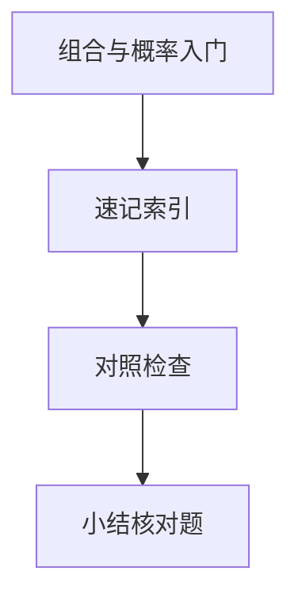

# 组合与概率入门

**组合**计数「有多少种选法」，**概率**量化「随机事件多大可能」。A/B 测试解读、缓存命中率估算、算法期望复杂度、抽奖公平性，都需要离散概率的语言 — 不必推到测度论，但要会乘加原理与条件概率。

---

## 计数原理

| 原理 | 公式/含义 |
|------|-----------|
| **加法** | 互斥事件：方式数相加 |
| **乘法** | 分步独立：方式数相乘 |
| **排列** P(n,k) = n!/(n−k)! | 顺序有关 |
| **组合** C(n,k) = n!/(k!(n−k)!) | 顺序无关 |

```javascript
// 组合 C(n,k) — 面试常手写
function comb(n, k) {
  if (k > n || k < 0) return 0;
  k = Math.min(k, n - k);
  let num = 1, den = 1;
  for (let i = 0; i < k; i++) {
    num *= n - i;
    den *= i + 1;
  }
  return num / den;
}
```

**例子**：8 位密码仅小写字母 → 26⁸ 种（乘法原理）；从 10 个路由选 3 个做 prefetch 且不分顺序 → C(10,3)。

**重复排列**：n 个元素取 k 个可重复 → n^k（每位 n 种选择）。验证码 6 位数字 → 10⁶。

---

## 概率公理（离散）

| 概念 | 定义 |
|------|------|
| 样本空间 Ω | 所有结果 |
| 事件 A | Ω 的子集 |
| P(A) | 0 ≤ P(A) ≤ 1，P(Ω)=1 |
| 互斥并 | P(A∪B)=P(A)+P(B) |

**条件概率**：

```plaintext
P(A|B) = P(A∩B) / P(B)   （P(B)>0）
```

**贝叶斯**：

```plaintext
P(A|B) = P(B|A) · P(A) / P(B)
```

```mermaid
flowchart LR
  Prior[先验 P A]
  Likelihood[似然 P B|A]
  Posterior[后验 P A|B]
  Prior --> Posterior
  Likelihood --> Posterior
```

前端场景：错误监控中「某版本崩溃 | 用户报错」用于定位回归 — 注意**基率**（先验）影响结论。若崩溃版本用户占比仅 1%，即使 P(报错|崩溃) 很高，P(崩溃|报错) 仍可能被稀释。

---

## 期望与方差（入门）

| 量 | 离散定义 | 直觉 |
|----|----------|------|
| **期望 E[X]** | Σ x·P(X=x) | 长期平均 |
| **方差 Var(X)** | E[(X−E[X])²] | 波动程度 |

**期望线性性**：E[aX+bY] = aE[X]+bE[Y]（X,Y 不必独立）— 常用于算法分析。

**指示变量技巧**：定义 `I_i = 1` 当第 i 次比较发生交换，则交换总次数 = Σ I_i，期望 = Σ P(I_i=1) — QuickSort 平均 O(n log n) 的经典证法。

**QuickSort 平均比较次数** O(n log n) 即对随机 pivot 的期望 — 最坏 O(n²) 当 pivot 总选最值。

---

## 常见分布（了解）

| 分布 | 场景 |
|------|------|
| **伯努利/二项** | n 次独立成功次数 — 转化率 |
| **几何** | 首次成功所需次数 — 重试次数 |
| **泊松** | 单位时间事件数 — QPS 尖峰近似 |

**二项期望**：E[X] = np，Var(X) = np(1−p)。1000 次请求、单请求错误率 0.1% → 期望错误 1 次，标准差 √np(1−p) ≈ 1 — 小样本波动大，勿过度解读单次 A/B。

```javascript
// 几何分布：首次成功试验次数期望 E = 1/p
// p=0.01 时平均需 100 次才成功一次
```

---

## 与前端实践的衔接

| 场景 | 工具 |
|------|------|
| 特征组合爆炸 | 乘法原理 + 剪枝 |
| 采样/蓄水池 | 均匀概率 |
| 实验显著性 | 假设检验（工程化监控延伸） |

模运算与期望在计数 DP、随机算法分析里常一起出现 — 快速幂与不变量是同一套数学底座。

---

## 独立性与乘法

若 A、B **独立**：`P(A∩B) = P(A)·P(B)`。多次独立试验的成功次数服从二项分布 — A/B 各组样本若未随机分流，「独立」假设不成立，结论无效。

| 场景 | 是否独立 |
|------|----------|
| 有放回抽样 | 通常独立 |
| 无放回抽牌 | 不独立 |
| 同一用户多次曝光 | 一般不独立 |

```plaintext
至少一次成功的补事件：P(≥1) = 1 − P(全失败)
P(全失败) = (1−p)^n   （n 次独立，单次成功概率 p）
```

**并集上界（Union Bound）**：P(A∪B∪…) ≤ Σ P(A_i) — 多个低概率事件「至少一个发生」的粗上界，用于风险评估。

---

## 生日悖论（直觉校准）

23 人中至少两人同月同日生的概率 > 50% — 因为比较的是 **C(23,2)** 对日期，不是「某固定日期」。这类题提醒：**独立试验次数**与「至少一次」的补事件算法，在碰撞 hash、缓存槽冲突估算里同源。

| n 人 | 近似 P(至少一对同生日) |
|------|------------------------|
| 10 | ~12% |
| 23 | ~51% |
| 50 | ~97% |

**Hash 碰撞**：64 位 hash 空间极大，但生日悖论说明「对数规模 √N 量级」就可能出现碰撞 — 布隆过滤器、Merkle 树设计时心里有数。

---

## 蒙特卡洛与采样（直觉）

用随机抽样估计概率或积分 — 前端少见纯 MC，但 **A/B 分流**、**蓄水池抽样**（流式 TopK 均匀采样）同源。

```javascript
// 蓄水池：第 i 个元素（i≥k）以概率 k/i 替换池中随机一个
function reservoirSample(stream, k) {
  const pool = stream.slice(0, k);
  for (let i = k; i < stream.length; i++) {
    const j = Math.floor(Math.random() * (i + 1));
    if (j < k) pool[j] = stream[i];
  }
  return pool;
}
```

---

## A/B 测试读数 caution

| 误区 | 正确理解 |
|------|----------|
| 转化率 2% vs 2.5% 即显著 | 需样本量、置信区间、多重比较校正 |
| 看单日数据 | 周期效应、工作日/周末 |
| p 值很小即「效应大」 | 大样本下微小差异也可显著 |

工程上配合监控告警，统计推断交给专业工具；原理层知道 **独立、基率、期望方差** 即可避免明显误判。

---

## 容斥在计数中的应用

「至少使用 React 或 Vue 技能的前端」= |React| + |Vue| − |两者都会|。与集合篇容斥公式一致 — 概率与计数共用同一骨架。

---

## 常见计数

| 公式 | 场景 |
|------|------|
| C(n,k) | 无序选 k |
| P(n,k) | 有序排列 |
| 二项 | n 次独立试验 |

生日悖论：23 人约 50% 同月同日 — 概率直觉常错。
## 期望线性性

E(X+Y)=E(X)+E(Y) 无需独立 — 指示变量法求期望常用。

几何分布：首次成功试验次数；二项：n 次成功次数。
---

## 速记索引

| 小节 | 复习方式 |
|------|----------|
| A/B 测试读数 caution | 复述定义 + 举一个前端相关例子 |
| 容斥在计数中的应用 | 复述定义 + 举一个前端相关例子 |
| 常见计数 | 复述定义 + 举一个前端相关例子 |
| 期望线性性 | 复述定义 + 举一个前端相关例子 |

## 对照检查

| 维度 | 自检 |
|------|------|
| A/B 测试读数 caution 易错 | 对照上文「易混点」或表格中的对比项 |
| 容斥在计数中的应用 易错 | 对照上文「易混点」或表格中的对比项 |
| 常见计数 易错 | 对照上文「易混点」或表格中的对比项 |
| 期望线性性 易错 | 对照上文「易混点」或表格中的对比项 |



本节目标：离开文档仍能解释 **组合与概率入门** 的核心机制，并能在浏览器、Node 或工程排障中指认对应现象。
## 小结

计数用加乘原理区分排列与组合；概率用条件概率与贝叶斯更新信念；期望支撑算法平均复杂度分析。

**易混点**：排列与组合是否计顺序；P(A|B) 与 P(B|A) 方向相反；独立 ≠ 互斥；小样本比例不能当精确概率；几何分布「无记忆性」仅对指数类成立。

核对：从 52 张牌抽 5 张有多少种？若 P(A)=0.3、P(B)=0.5、P(A∩B)=0.1，求 P(A|B)。n 次独立试验至少成功一次的概率公式？
