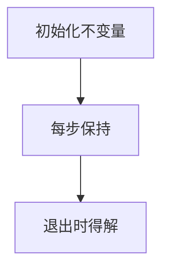

# 算法题中的数学工具

LeetCode 与面试手写题里，**模运算、前缀和、不变量、位运算**出现频率不亚于纯数据结构。把离散数学工具映射到题型，可减少「记题」而转向「认模式」 — 与 05-算法 各章互补。

---

## 模运算与同余

| 性质 | 式子 |
|------|------|
| 加减乘 | `(a±b) mod m = ((a mod m)±(b mod m)) mod m` |
| 防溢出 | 大数计数题常用 10⁹+7 |
| 费马小定理 | p 质数时 `a^(p-1) ≡ 1 (mod p)` — 求逆元 |

```javascript
const MOD = 1e9 + 7;
function add(a, b) { return ((a % MOD) + (b % MOD)) % MOD; }
function mul(a, b) { return ((a % MOD) * (b % MOD)) % MOD; }
```

**场景**：路径计数、斐波那契第 n 项、哈希冲突分析（了解）。

**除法**：`(a/b) mod m` 需乘 **b 的模逆元** `b^(m-2) mod m`（m 为质数），不能直接除。

---

## 前缀和与差分

| 技巧 | 作用 |
|------|------|
| **前缀和** | 区间和 O(1) |
| **二维前缀** | 子矩阵和 |
| **差分数组** | 区间加 O(1) |

```javascript
function prefixSum(nums) {
  const p = [0];
  for (const x of nums) p.push(p.at(-1) + x);
  return p; // sum(i..j) = p[j+1]-p[i]
}

// 差分：对 [l,r] 全体 +v
function rangeAdd(diff, l, r, v) {
  diff[l] += v;
  diff[r + 1] -= v;
}
// 还原：对 diff 做前缀和得每点增量
```

**子数组和为 k**：前缀和 + 哈希 `count[prefix−k]` — 05-04 滑动窗口章的代数版。

与 04-数据结构 数组章衔接。

---

## 位运算

| 运算 | 典型用途 |
|------|----------|
| `x & 1` | 奇偶 |
| `x & (x-1)` | 清除最低位 1 — 统计 1 的个数 |
| `a ^ a = 0` | 找单独出现一次的数 |
| `x << 1` | 乘 2 |
| `1 << n` | 子集枚举状态压缩 |

```javascript
function singleNumber(nums) {
  return nums.reduce((a, b) => a ^ b, 0);
}

function countOnes(n) {
  let c = 0;
  while (n) { n &= n - 1; c++; }
  return c;
}
// countOnes(12) → 12=1100₂ → 清除两次 → 2
```

**子集枚举**：n ≤ 20 时常用 `for (mask = 0; mask < 1<<n; mask++)` 遍历所有子集。

---

## 不变量与循环证明

| 题型 | 不变量示例 |
|------|------------|
| 快慢指针判环 | 入环后相对距离不变 |
| 反转链表 | 已反转部分与原链表正确衔接 |
| 二分 | 答案始终在缩小的区间内 |
| 荷兰国旗 | `[0,i)` 为 0，`[i,j)` 为 1 |



**数学归纳法**证明循环正确性：基础步验证初始不变量，归纳步证明每轮循环保持 — 与双指针、二分缩区间同一套「退出时必得解」逻辑。

**例：盛最多水的容器** — 双指针向内，每次移动较短边；不变量：最优解必在尚未排除的区间内。

---

## 数学公式速查

| 问题 | 公式/结论 |
|------|-----------|
| 等差数列和 | n(a₁+aₙ)/2 |
| 1+2+…+n | n(n+1)/2 |
| 1+2+…+n² | n(n+1)(2n+1)/6 |
| 卡特兰数 | C(2n,n)/(n+1) — 合法括号、BST 形态数 |
| gcd | 欧几里得算法 |
| lcm | a·b/gcd(a,b) |

```javascript
function gcd(a, b) { return b === 0 ? a : gcd(b, a % b); }
function lcm(a, b) { return (a / gcd(a, b)) * b; }
```

---

## 题型 ↔ 工具对照

| 信号词 | 工具 |
|--------|------|
| 「多少种方案」 | DP / 组合 |
| 「区间更新/query」 | 前缀和、线段树（了解） |
| 「重复/缺失」 | 异或、哈希 |
| 「整除/余数」 | 模运算、数论 |
| 「第 k 小」 | 二分答案 |
| 「最大公约数/同余方程」 | 扩展欧几里得 |

---

## 快速幂与矩阵加速

斐波那契第 n 项、路径计数常配合 **快速幂** `O(log n)` 次乘法；矩阵形式 `[[1,1],[1,0]]^n` 是同一套路的封装。

```javascript
function powMod(base, exp, mod) {
  let res = 1n, b = BigInt(base), e = BigInt(exp);
  while (e > 0n) {
    if (e & 1n) res = (res * b) % BigInt(mod);
    b = (b * b) % BigInt(mod);
    e >>= 1n;
  }
  return Number(res);
}
```

大数题用 `BigInt` 或拆模；面试说明「防 `Number` 溢出」即可。

---

## 数论小题

| 问题 | 方法 |
|------|------|
| 质数判定 | 试除到 √n |
| 筛法 | 埃氏筛 O(n log log n) |
| 同余方程 ax≡b (mod m) | 扩展 gcd |

```javascript
// 扩展欧几里得 — 求 ax+by=gcd(a,b)
function extGcd(a, b) {
  if (b === 0) return [a, 1, 0];
  const [g, x1, y1] = extGcd(b, a % b);
  return [g, y1, x1 - Math.floor(a / b) * y1];
}
```

前端工程直接用到较少，但「哈希表容量取质数」「随机化算法」背景题会出现。

---

## 排列组合在 DP 中的角色

「从 n 选 k 且不计顺序」→ C(n,k)；「网格路径只向右下」→ C(2n,n) 或 DP。认公式可快速验证小样例，避免 DP 状态定义错误。

```plaintext
杨辉三角：C(n,k) = C(n-1,k-1) + C(n-1,k)
```

---

## 博弈与奇偶（了解）

Nim 堆异或和为 0 则后手必胜 — 部分「谁先手必赢」题可归结为不变量 + 奇偶。前端面试偶见，知道「找不变量」比记结论重要。

---

## 模运算工程注意

| 运算 | 直接写 | 安全写法 |
|------|--------|----------|
| 加法 | `(a+b)%m` | 先加再 mod，或用 `(a%m+b%m)%m` |
| 乘法 | `(a*b)%m` | 大数用 `BigInt` |
| 除法 | `(a/b)%m` | 乘逆元 `a * inv(b) % m` |

```javascript
// 费马小定理求逆元（m 为质数）
function inv(a, m) {
  return powMod(a, m - 2, m);
}
```

面试说明「除法在模下等价于乘逆元」即可，不必推导完整数论。
## 小结

模运算防溢出；前缀和/差分处理区间；位运算压缩状态；**不变量**连接证明与双指针。认信号词比背题号更高效。

**易混点**：模运算中除法需逆元，不能 `(a/b)%m` 直接除；前缀和下标 off-by-one；异或仅适用于成对重复或单次出现场景；快速幂底数要先 mod。

核对：`x & (x-1)` 对 x=12 的结果？用前缀和如何 O(1) 求 nums[i..j] 之和？C(2n,n) 与卡特兰数的关系一句？
