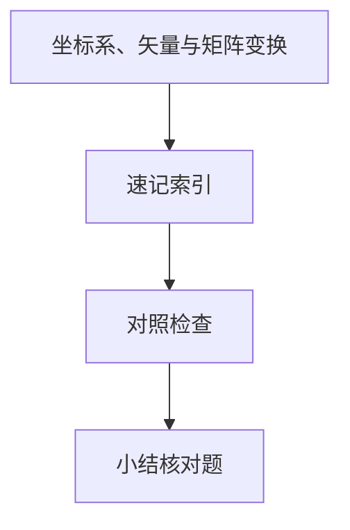

# 坐标系、矢量与矩阵变换

**2D/3D 图形**先把几何对象放进坐标系，再用**矩阵**表达平移、旋转、缩放。CSS `transform`、Canvas `setTransform`、WebGL 的 MVP 链，本质都是仿射变换的组合 — 搞清矩阵乘法顺序，就能解释「为什么旋转绕错点」。

---

## 坐标系

| 类型 | 特点 | Web 常见 |
|------|------|----------|
| **笛卡尔** | x 右、y 上（数学）或 y 下（屏幕） | Canvas 原点左上，y 向下 |
| **齐次坐标** | (x,y,1) 表示 2D 点，统一平移为矩阵乘 | WebGL |
| **左手/右手** | z 轴方向约定 | WebGL 右手系 |
| **NDC** | 归一化设备坐标 −1～1 | WebGL 裁剪后 |

```javascript
// Canvas：y 向下 — 与数学坐标差一个翻转
ctx.scale(1, -1);
ctx.translate(0, -height);
```

**易混点**：DOM 布局坐标 ≠ Canvas 像素坐标 ≠ WebGL NDC（−1~1）。

---

## 矢量基础

| 运算 | 含义 | 用途 |
|------|------|------|
| 点积 `a·b` | \|a\|\|b\|cosθ | 夹角、投影、光照 |
| 叉积 `a×b` | 面积、法向（3D） | 背面剔除 |
| 归一化 | 单位向量 | 方向光 |
| 长度 | `hypot(x,y)` | 距离、碰撞半径 |

```javascript
function dot(a, b) { return a.x * b.x + a.y * b.y; }
function len(v) { return Math.hypot(v.x, v.y); }
function normalize(v) {
  const l = len(v) || 1;
  return { x: v.x / l, y: v.y / l };
}
// 两向量夹角：Math.acos(dot(na, nb))
```

**投影**：向量 a 在 b 上的投影长度 = `(a·b)/|b|` — 阴影、拖拽吸附沿轴移动常用。

---

## 2D 仿射变换矩阵

```plaintext
| a c tx |
| b d ty |
| 0 0  1 |
```

| 变换 | 矩阵（示意） |
|------|--------------|
| 平移 | tx, ty |
| 缩放 | sx, sy 在对角 |
| 旋转 θ | cos/sin 组合 |

**组合顺序**：矩阵乘法**从右向左**作用于列向量：`M = T · R · S` 表示先缩放、再旋转、再平移（具体以 API 文档为准 — CSS 与 Canvas 右乘习惯略有差异，以实际变换结果验证）。


---

## CSS 与 Canvas 对照

| API | 形式 |
|-----|------|
| CSS | `transform: translate() rotate() scale()` |
| Canvas 2D | `transform(a,b,c,d,e,f)` 六参数 |
| WebGL | 4×4 矩阵 uniform |

```javascript
// 绕点 (cx,cy) 旋转 θ
function rotateAround(ctx, cx, cy, rad) {
  ctx.translate(cx, cy);
  ctx.rotate(rad);
  ctx.translate(-cx, -cy);
}

// 六参数与 3×3 对应：
// | a  c  e |
// | b  d  f |
// | 0  0  1 |
```

**CSS transform 列表**：从右向左应用 — `transform: translate(100px) rotate(45deg)` 先旋转再平移（书写顺序与数学左乘习惯易混）。

---

## 常见坑：变换顺序

```javascript
// 错误：先旋转再平移 → 绕原点转，物体飞走
ctx.rotate(Math.PI / 4);
ctx.translate(100, 0);

// 期望绕自身中心转：translate → rotate → 绘制偏移后的图形
ctx.save();
ctx.translate(cx, cy);
ctx.rotate(Math.PI / 4);
ctx.fillRect(-w / 2, -h / 2, w, h);
ctx.restore();
```

CSS `transform-origin` 改变默认旋转中心 — 等价于额外平移包装。

---

## 逆矩阵与拾取

**逆变换**把屏幕点映回世界/局部坐标 — 命中测试、拖拽手柄计算依赖 `M⁻¹`。

| 步骤 | 说明 |
|------|------|
| 屏幕像素 | 归一化到 NDC 或 Canvas 逻辑坐标 |
| 乘逆 View-Projection | 得射线或平面交点 |
| 乘逆 Model | 局部空间判定 |

CSS `matrix()` 六值与 Canvas `transform` 同构；只含平移旋转缩放时逆矩阵可解析求，一般库用伴随式或 LU。

```javascript
// 2D 仿射逆：若 M = [a c e; b d f; 0 0 1]
// det = a*d - b*c；det=0 不可逆（压成线/点）
```

---

## 透视与 3D 简述

**正交投影**：平行线保持平行，适合 UI、CAD 2D。**透视投影**：近大远小，4×4 矩阵含 `w` 分量，透视除法 `x/w, y/w`。

| 链 | 矩阵 |
|----|------|
| Model | 物体局部 → 世界 |
| View | 世界 → 相机 |
| Projection | 相机 → 裁剪空间 |

Model（物体）→ View（相机）→ Projection（透视）→ Viewport 像素。透视除法把裁剪空间坐标映射到 NDC，再经视口变换到屏幕像素。

**欧拉角万向节锁**：三轴顺序旋转时某轴失去自由度 — 游戏/3D 常用四元数 `slerp` 插值旋转（了解即可）。

---

## SVG 与 DOM transform

SVG `transform="matrix(a b c d e f)"` 与 Canvas 同构；DOM 元素的 `getBoundingClientRect()` 返回**已变换**后的轴对齐包围盒，非局部几何 — 命中测试要区分。

---

## 与 3D / WebGL 的衔接

Model（物体）→ View（相机）→ Projection（透视）→ Viewport 像素。Viewport 把 NDC 映射到 canvas 像素宽高。

```plaintext
clip_x = (ndc_x + 1) * 0.5 * width
clip_y = (1 - ndc_y) * 0.5 * height   // y 常翻转
```

---

## 变换顺序

矩阵乘法**从右向左**作用于列向量：`M = T * R * S` 先缩放再旋转再平移。

| 空间 | 用途 |
|------|------|
| 模型 | 物体局部 |
| 世界 | 场景 |
| 视图 | 相机 |
| 裁剪/NDC | 投影后 |
## 齐次坐标

w=1 点，w=0 方向向量；透视除法 x/w,y/w 得 NDC。

CSS `matrix3d` 与 WebGL 列主序一致 — 注意与数学教材行主序书写差异。
---

## 速记索引

| 小节 | 复习方式 |
|------|----------|
| SVG 与 DOM transform | 复述定义 + 举一个前端相关例子 |
| 与 3D / WebGL 的衔接 | 复述定义 + 举一个前端相关例子 |
| 变换顺序 | 复述定义 + 举一个前端相关例子 |
| 齐次坐标 | 复述定义 + 举一个前端相关例子 |

## 对照检查

| 维度 | 自检 |
|------|------|
| SVG 与 DOM transform 易错 | 对照上文「易混点」或表格中的对比项 |
| 与 3D / WebGL 的衔接 易错 | 对照上文「易混点」或表格中的对比项 |
| 变换顺序 易错 | 对照上文「易混点」或表格中的对比项 |
| 齐次坐标 易错 | 对照上文「易混点」或表格中的对比项 |



本节目标：离开文档仍能解释 **坐标系、矢量与矩阵变换** 的核心机制，并能在浏览器、Node 或工程排障中指认对应现象。
## 小结

屏幕坐标 y 向下与数学坐标相反；仿射变换用 3×3（2D）或 4×4（3D）齐次矩阵；**变换顺序**决定最终效果，绕点旋转需「平移-旋转-反平移」。

**易混点**：CSS `transform-origin` 改变旋转中心；矩阵乘法不满足交换律；欧拉角万向节锁（3D）；Canvas 当前矩阵左乘新变换。

核对：Canvas 中先 `translate(100,0)` 再 `scale(2,2)` 与反过来有何不同？点 (1,0) 绕原点逆时针 90° 的坐标？
