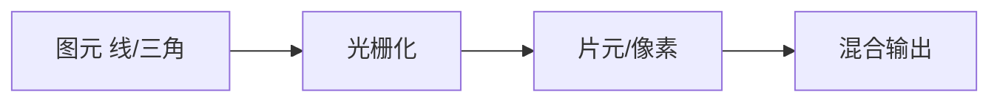
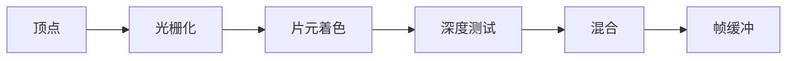

# 光栅化与抗锯齿

**矢量描述**（直线、贝塞尔）最终要变成**像素网格**才能显示 — 这一过程叫**光栅化**。边缘阶梯（锯齿）来自离散采样；抗锯齿通过提高采样质量或后处理平滑边缘。理解光栅化，能解释 Canvas 线条发虚、SVG 缩放 crisp 与 `image-rendering` 的差异。

---

## 光栅化流程



| 阶段 | 2D Canvas | GPU |
|------|-----------|-----|
| 图元 | path、rect | 三角形 |
| 扫描 | CPU 软件光栅 | 并行片元着色 |
| 输出 | ImageData 像素 | 帧缓冲 |

**Bresenham / DDA**：直线光栅经典算法 — 整数步进选像素，避免浮点误差累积。面试了解「为何斜线也呈阶梯」即可。

---

## 像素对齐与模糊

| 现象 | 原因 |
|------|------|
| 1px 线变粗/变糊 | 坐标落在像素边界之间，半覆盖多像素 |
| `strokeRect(10.5,10.5,...)` | 0.5 偏移对齐像素中心（奇数线宽） |

```javascript
//  crisp 1px 水平线（奇数线宽）
const y = Math.floor(lineY) + 0.5;
ctx.beginPath();
ctx.moveTo(0, y);
ctx.lineTo(width, y);
ctx.stroke();

// 偶数线宽：对齐整像素边界 y = Math.round(lineY)
```

**devicePixelRatio**：Retina 上 CSS 像素 ≠ 物理像素 — Canvas 需 `width = cssWidth * dpr` 避免糊。逻辑尺寸与 backing store 需分别设置。

---

## 锯齿与采样

**别名（Aliasing）**：高频细节以低于 Nyquist 的频率采样 → 摩尔纹、锯齿。

| 策略 | 做法 | 代价 |
|------|------|------|
| **超采样 SSAA** | 更高分辨率再缩小 | 内存/算力 |
| **MSAA** | 多重采样边缘 | GPU 常用 |
| **FXAA/SMAA** | 后处理模糊边缘 | 可能损细节 |
| **TAA** | 时序累积多帧 | 动态场景拖影 |

Canvas：`imageSmoothingEnabled` 控制缩放插值；`imageSmoothingQuality = 'high'`。

**Nyquist 直觉**：采样频率至少 2× 信号最高频率 — 纹理细节比像素密度还密时必 alias。

---

## 线宽与 miter

| 概念 | 说明 |
|------|------|
| **lineCap** | butt / round / square |
| **lineJoin** | miter / round / bevel |
| **miterLimit** | 尖角过尖时改 bevel |

```javascript
ctx.lineWidth = 2;
ctx.lineJoin = 'round'; // UI 图标常用
ctx.miterLimit = 10;
```

SVG：`shape-rendering="crispEdges"` vs `geometricPrecision` — 权衡锯齿与几何准确。

**stroke 对齐**：偶数线宽贴整像素、奇数线宽加 0.5 偏移 — 与 CSS `border` 在高分屏上的糊边同源。

---

## 与 CSS / 图片的衔接

| 属性 | 效果 |
|------|------|
| `-webkit-font-smoothing` | 字体亚像素 |
| `image-rendering: pixelated` | 最近邻，像素风 |
| `image-rendering: crisp-edges` | 保留硬边，浏览器实现略有差异 |
| `transform: translateZ(0)` | 层提升，可能改变抗锯齿 |

---

## 子像素与文本

**ClearType** 等子像素渲染利用 RGB 条纹排列，在 **1× dpr** 竖线最清晰；整页 `scale` 或非整数 dpr 时子像素策略可能关闭，字体变糊。

| 场景 | 建议 |
|------|------|
| 图标 font-icon | 对齐像素网格；偶数 em |
| 动画 scale | 预期边缘软化 |
| PDF/导出 | 栅格化 DPI 固定 |

SVG 转 Canvas 再导出 PNG 会经历二次光栅化 — 矢量源优先直接导出。

---

## 纹理采样与摩尔纹（延伸）

位图放大时，若采样频率低于纹理细节频率，会出现**摩尔纹** — GPU 用 **Mipmap**（多级渐远纹理）缓解；Canvas 2D 缩放靠 `imageSmoothingQuality`，本质仍是插值采样。

| 缩放方式 | 效果 |
|----------|------|
| 最近邻 | 锐利、锯齿感（像素风） |
| 双线性 | 平滑、细节糊 |
| 三线性 + Mipmap | 远距稳定、减闪烁 |

**SVG vs Canvas**：SVG 保留矢量，任意缩放由引擎重光栅；Canvas 位图放大即插值糊 — 图标需多分辨率时用 SVG 或 `@2x` 位图资源。

---

## 高清屏 backing store

```javascript
const dpr = window.devicePixelRatio || 1;
canvas.width = cssW * dpr;
canvas.height = cssH * dpr;
ctx.scale(dpr, dpr);
// 逻辑坐标仍用 cssW/cssH，物理像素为 dpr 倍
```

不 scale canvas 内部尺寸则线条发虚 — 与 CSS 仅放大 `<canvas>` 元素不同。

---

## 截图与 `toDataURL`

导出位图后再缩放，锯齿与糊度由导出 DPI 决定；高保真导出应提高 canvas 像素尺寸而非仅靠 CSS 放大。`toBlob`/`toDataURL` 读的是 backing store 当前分辨率。

---

## 填充规则与边缘

`fill('nonzero')` vs `fill('evenodd')` 影响复杂 path 哪些区域被光栅填充 — 带孔 SVG、布尔路径合并后边缘锯齿表现可能不同。

---

## 抗锯齿

| 方法 | 说明 |
|------|------|
| SSAA | 超采样贵 |
| MSAA | 边缘多采样 |
| FXAA | 后处理模糊 |

CSS `transform` 子像素可能触发抗锯齿 — 1px 线模糊常因半像素对齐。
## 子像素布局

LCD RGB 子像素 — `subpixel-antialiased` 字体利用彩色条纹，非 Retina 可能彩边。
---
---

## 缩放滤波

Canvas `imageSmoothingEnabled` 控制位图缩放 — 像素艺术常关闭。MSAA 只对几何边缘，shader 内渐变 alias 需 gamma 处理。
## 边缘规则

OpenGL 中心规则：像素中心在边内则填充 — 共享边只绘一次，避免缝隙与双倍绘制。

---

## 例题：Canvas 1px 线对齐

```javascript
const ctx = canvas.getContext('2d');
ctx.lineWidth = 1;
// 奇数线宽 + 整数坐标 → 跨两像素变糊
ctx.beginPath();
ctx.moveTo(10.5, 0);   // +0.5 对齐像素中心
ctx.lineTo(10.5, 100);
ctx.stroke();
```

| 线宽 | 推荐 x/y |
|------|----------|
| 1px | n + 0.5 |
| 2px | 整数 |

`imageSmoothingEnabled = false` 放大像素风素材时用最近邻，避免双线性糊边。

---

## 采样方式对比（面试表）

| 方法 | 代价 | 效果 |
|------|------|------|
| 点采样 | 低 | 锯齿 |
| 双线性 | 中 | 平滑、细节损失 |
| 三线性+mipmap | 较高 | 远距稳定 |
| MSAA | GPU 内存 | 几何边缘 |
| FXAA | 后处理 | 全屏略糊 |

CSS `transform: scale(1.001)` 可能触发子像素抗锯齿 — 动画结束恢复整数 scale 可减模糊。

---

## GPU 光栅化管线（简图）



Canvas 2D 走 CPU 光栅；WebGL/WebGPU 走 GPU 管线 — 理解「为何 transform 有时走合成层、有时重绘」。

## 小结

光栅化把矢量变为像素；**半像素偏移**与 **dpr** 决定 1px 线是否清晰。抗锯齿本质是更好采样或边缘平滑，没有免费午餐。

**易混点**：抗锯齿 ≠ 提高分辨率 UI；Canvas 默认缩放用双线性插值；GPU MSAA 主要抗几何边缘，不解决纹理摩尔纹（需 mipmapping）；`crisp-edges` 与 `pixelated` 语义因浏览器略有差异。

核对：为何 1px 竖线在 x=10 可能显示 2px 宽？`imageSmoothingEnabled=false` 缩放小图会怎样？奇数线宽为何要 +0.5？
