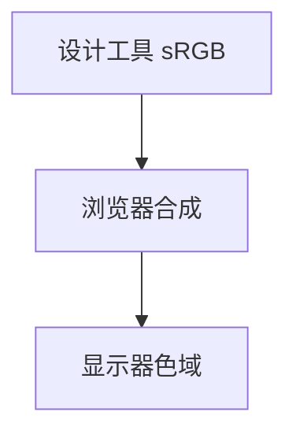

# 颜色空间与 Gamma

**颜色**不仅是 RGB 三元组，还绑定**色彩空间**（sRGB、Display P3）与**传递函数**（Gamma）。浏览器混色、Canvas 导出、设计稿还原偏差，常源于「线性光 vs 编码值」混用 — 前端做动效、渐变、混合模式时尤其容易踩坑。

---

## 从物理到像素

| 概念 | 含义 |
|------|------|
| **线性光** | 光强相加符合物理 |
| **编码值（sRGB）** | 非线性压缩，贴近人眼感知 |
| **Gamma** | 约 2.2（sRGB 为分段曲线，常口语称 gamma） |

```plaintext
显示值 ≈ 线性光 ^ (1/2.2)   （简化直觉）
解码：linear = sRGB^2.4（分段公式更精确）
```

**易混点**：CSS `#808080` 是 **sRGB 编码值**，不是线性光的一半亮度 — 人眼感知的「中灰」在线性光约 18% 左右。

---

## 常见色彩空间

| 空间 | 用途 |
|------|------|
| **sRGB** | Web 默认、多数显示器 |
| **Display P3** | 广色域 Apple 设备 |
| **CIE Lab / OKLab** | 感知均匀，色差计算 |
| **HSL/HSV** | 极坐标直觉，非感知均匀 |


CSS Color Level 4：`color(display-p3 1 0.2 0.3)`；`color-mix(in srgb, red, blue)` 指定混合空间；`oklch()` 支持感知均匀插值。

---

## 混合为何发灰

在线性光下：`0.5红 + 0.5绿 → 黄`。在 **sRGB 编码值**直接平均：`rgb(128,0,0)` 与 `rgb(0,128,0)` 混成 **暗灰棕** — 经典「渐变脏边」。

| 做法 | 效果 |
|------|------|
| 错误 | 对 hex 线性插值 |
| 正确 | 转线性 → 插值 → 转 sRGB |

Canvas：无内置线性空间；复杂渐变可用 WebGL 或手动 gamma 校正（见上文 `toLinear` / `toSRGB`）。

```javascript
// sRGB 分量 → 线性（标准分段）
function toLinear(c) {
  c /= 255;
  return c <= 0.04045 ? c / 12.92 : ((c + 0.055) / 1.055) ** 2.4;
}
function toSRGB(l) {
  const c = l <= 0.0031308 ? 12.92 * l : 1.055 * l ** (1 / 2.4) - 0.055;
  return Math.round(Math.min(1, Math.max(0, c)) * 255);
}

function lerpSRGB(c1, c2, t) {
  return [
    toSRGB(toLinear(c1[0]) * (1 - t) + toLinear(c2[0]) * t),
    toSRGB(toLinear(c1[1]) * (1 - t) + toLinear(c2[1]) * t),
    toSRGB(toLinear(c1[2]) * (1 - t) + toLinear(c2[2]) * t),
  ];
}
```

---

## Alpha 与预乘

| 类型 | 存储 | 混合公式直觉 |
|------|------|--------------|
| **非预乘** | (R,G,B,A) | 需 unpremultiply |
| **预乘 alpha** | (R×A,G×A,B×A,A) | 滤波更正确 |

PNG 通常非预乘；视频/WebGL 纹理常预乘。Canvas `globalAlpha` 与 `globalCompositeOperation: 'source-over'` 按 Porter-Duff 规则混合。

** Porter-Duff over **：`out = src × α + dst × (1−α)` — 在线性光下做才物理正确；浏览器部分路径在 sRGB 下混合，跨浏览器渐变一致时需固定空间测试。

---

## 前端实践清单

| 场景 | 建议 |
|------|------|
| UI 纯色 | sRGB 即可 |
| 半透明叠层 | 注意混合空间；Figma 与浏览器可能不一致 |
| 广色域图 | `color-profile`、提供 sRGB fallback |
| 视频 | BT.709 / HDR 另论 |
| 无障碍对比度 | 用相对 luminance，非 hex 平均 |

---

## CSS 混色与 filter

`mix-blend-mode`、`filter: blur()` 在不同浏览器中可能在 **sRGB 或线性**空间执行 — 跨浏览器渐变一致时需在固定空间测试。

```css
/* color-mix 显式空间（支持度递增） */
background: color-mix(in srgb, #f00 50%, #0f0);
background: color-mix(in oklab, #f00 50%, #0f0);
```

**相对 luminance**（WCAG 对比度）在线性光上计算：

```plaintext
L = 0.2126*R + 0.7152*G + 0.0722*B   （R,G,B 为线性分量）
对比度 = (L1 + 0.05) / (L2 + 0.05)
```

直接用 hex 插值算对比度会偏差 — 无障碍审计工具已内置转换。

---

## 设计稿与浏览器色差

Figma/Sketch 导出 sRGB PNG，在 P3 屏上可能更艳；在 sRGB 屏上广色域图会被 **gamut mapping** 压饱和。验收 UI 时在目标设备上看，不要只信开发机截图。



动效里「透明度渐变」若直接 lerp hex，中间帧发灰 — 高要求场景转线性再插值（见上文 `toLinear` / `toSRGB`）。

---

## HSL 与选色器

HSL 的 L=50% 并非感知中点；`hsl(0,100%,50%)` 纯红与 `hsl(120,100%,50%)` 纯绿在 sRGB 下直接插值 H 会经过无效色域。新语法 `oklch` 插值更稳。

---

## 打印与导出

PDF/打印管线通常仍走 sRGB；HDR 截图（部分 OS）带不同 electro-optical 传递 — Web 交付以 sRGB 为默认安全假设。

---

## sRGB vs 线性

| 空间 | 插值 |
|------|------|
| sRGB | 直接 lerp 发灰 |
| 线性 | 物理正确混合 |

Canvas/CSS 渐变在线性光下应先 `pow` 再插值 — 否则中间色偏暗。
## 显示链路

图片 sRGB → 解码线性 → 混合 → 编码 sRGB 输出。P3 广色域屏需 color-profile 元数据。
---
---

## 广色域

CSS `color(display-p3 ...)` 在 P3 屏上更饱和。混合前转线性 RGB，输出再编码 sRGB。
## 混合公式

线性空间：`out = src * α + dst * (1-α)`。sRGB 直接 lerp 会偏暗 — 先 `pow(x,2.2)` 再混合再 `pow(x,1/2.2)`。

---

## 例题：线性空间插值两色

```javascript
function toLinear(c) { return Math.pow(c / 255, 2.2); }
function toSRGB(c) { return Math.round(Math.pow(c, 1 / 2.2) * 255); }

function lerpSRGB(a, b, t) {
  const r = toSRGB(toLinear(a[0]) * (1 - t) + toLinear(b[0]) * t);
  const g = toSRGB(toLinear(a[1]) * (1 - t) + toLinear(b[1]) * t);
  const bl = toSRGB(toLinear(a[2]) * (1 - t) + toLinear(b[2]) * t);
  return `rgb(${r},${g},${bl})`;
}
// lerpSRGB([255,0,0],[0,255,0],0.5) 比直接平均 RGB 更接近感知「中间黄绿」
```

CSS `color-mix(in oklab, ...)` 在支持浏览器内由引擎做感知空间混合，手写时至少转线性 sRGB。

---

## 预乘 Alpha（premultiplied）

非预乘：`out = src * α + dst * (1-α)`（src 为 straight alpha）

预乘存储：`src' = src * α`，混合时 `out = src' + dst * (1-α)`

| | straight | premultiplied |
|---|----------|---------------|
| 边缘 | 暗边/亮边风险 | 合成更稳 |
| Canvas | 默认 straight | `context.globalCompositeOperation` 配合 |

PNG 导出、WebGL 纹理常要求预乘 — 与 sRGB 线性化是**独立**两步，需分别处理。

---

## WCAG 对比度计算步骤

1. 将 sRGB 通道 `c/255` 转线性：`c ≤ 0.03928 ? c/12.92 : ((c+0.055)/1.055)^2.4`
2. 相对亮度 `L = 0.2126*R + 0.7152*G + 0.0722*B`
3. 对比度 `(L_light + 0.05) / (L_dark + 0.05)`，要求正文 ≥ 4.5:1

设计 token 验收时用工具自动算 — 勿在 hex 空间目测「够不够深」。

---

## CSS 中常用颜色函数

| 函数 | 说明 |
|------|------|
| `srgb` | 默认 sRGB |
| `display-p3` | 广色域屏 |
| `oklch` | 感知均匀，设计系统新宠 |
| `color-mix` | 两色混合 |

---

## 小结

sRGB 是编码值，非线性；**线性空间混色**才符合物理直觉。Gamma 影响渐变、抗锯齿与感知亮度；alpha 预乘影响边缘质量。

**易混点**：亮度 50% 的灰 ≠ 线性光 50%；`opacity` 与 `rgba` alpha 通道叠加规则不同；P3 色在 sRGB 屏上会 gamut map；WCAG 对比度必须线性 luminance。

核对：两纯色各 50% 透明叠在白底，为何中间可能偏灰？sRGB 中 (0,255,0) 与 (255,0,0) 各 50% 编码平均为何不是黄？
