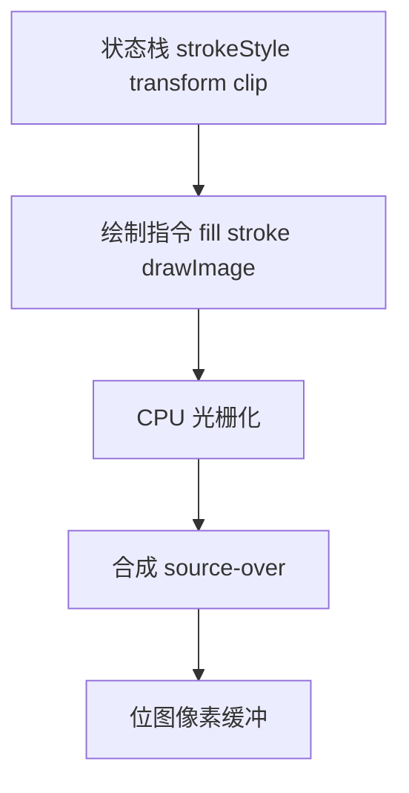
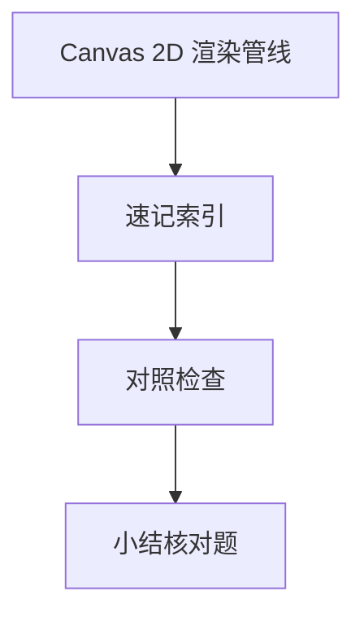

# Canvas 2D 渲染管线

**Canvas 2D** 提供即时模式绘图 API：路径、文本、位图绘制经**状态栈**与**合成器**写入位图。与 DOM/CSS 渲染树分离，适合图表、游戏、图像编辑 — 性能瓶颈常在状态切换与 readback，而非单条 `lineTo`。

---

## 管线概览



| 步骤 | API 示例 |
|------|----------|
| 状态 | `save` / `restore` |
| 几何 | `beginPath` / `arc` / `bezierCurveTo` |
| 绘制 | `fill` / `stroke` / `fillText` |
| 像素 | `getImageData` / `putImageData` |

**即时模式**：无场景图 retained tree — 每帧需自行重绘；与 SVG/DOM 对比见下文。

---

## 渲染状态

| 属性 | 影响 |
|------|------|
| `globalAlpha` | 全局透明度 |
| `globalCompositeOperation` | 混合模式 |
| `transform` | 当前矩阵 |
| `clip` | 裁剪区域 |
| `shadowBlur` | 阴影（触发额外 pass） |

```javascript
ctx.save();
ctx.globalAlpha = 0.5;
ctx.fillStyle = '#06f';
ctx.fillRect(0, 0, 100, 100);
ctx.restore(); // 恢复此前状态
```

**性能**：频繁 `save/restore`、复杂 `clip`、大区域 `shadowBlur` 会触发重绘 — 批量同类绘制，减少状态切换。

---

## 路径与填充规则

| 规则 | 行为 |
|------|------|
| **nonzero** | 默认，绕数非零即填 |
| **evenodd** | 奇偶规则，洞更易 |

```javascript
ctx.fill('evenodd'); // 带孔多边形
```

路径不绘制直到 `fill`/`stroke`；`closePath` 仅连接当前点与起点。`beginPath` 丢弃当前子路径，不自动清画布。

---

## 位图与 DPR

```javascript
function setupCanvas(canvas, cssWidth, cssHeight) {
  const dpr = devicePixelRatio || 1;
  canvas.style.width = cssWidth + 'px';
  canvas.style.height = cssHeight + 'px';
  canvas.width = cssWidth * dpr;
  canvas.height = cssHeight * dpr;
  const ctx = canvas.getContext('2d');
  ctx.scale(dpr, dpr);
  return ctx;
}
```

高分屏下需同时设置 CSS 尺寸与 canvas 像素尺寸，并用 `scale(dpr)` 把绘图坐标系拉回逻辑像素。

**改 `width/height` 属性**会重置整个画布状态并清空像素 — 与只改 CSS 尺寸不同。

---

## 与 DOM / WebGL 对比

| 特性 | Canvas 2D | DOM | WebGL |
|------|-----------|-----|-------|
| 模型 | 即时模式 | retained 场景图 | retained + shader |
| 文本 | 内置 | 原生排版 | 需纹理 |
| GPU | 部分加速 | 合成层 | 全 GPU |
| 适用 | 图表、像素操 | UI | 3D/大量精灵 |
| 事件命中 | 需自算坐标 | 原生 | 需 raycast |

**OffscreenCanvas + Worker**：把光栅化移出主线程，主线程只 `transferFromImageBitmap` 或 `drawImage` 合成 — 适合粒子、地图瓦片等 CPU 绘制重场景。

---

## 脏矩形与分层（概念）

全屏 `clearRect` 每帧简单但费；维护脏区只重绘变化区域。多层 Canvas 叠 DOM：`position:absolute` 分层减少整屏刷新。

```javascript
// 脏矩形示例：只清上一帧 bbox
ctx.clearRect(prev.x, prev.y, prev.w, prev.h);
drawEntity(entity);
prev = entity.bbox;
```

---

## 动画循环模式

```javascript
function loop(ts) {
  // 1. 可选：clearRect 或 半透明覆盖做拖尾
  // 2. 更新模型 state
  // 3. 重绘
  requestAnimationFrame(loop);
}
requestAnimationFrame(loop);
```

| 模式 | 说明 |
|------|------|
| 全清重绘 | 简单；粒子数大时贵 |
| 脏矩形 | 记录变化 bbox 再 clip |
| 离屏缓存 | 静态背景 drawImage 一次 |

`requestAnimationFrame` 与显示器刷新对齐，比 `setInterval` 更省无效帧 — 

---

## 文本与 measure 性能

`fillText` 每次可能触发布局字形；大量标注用 **离屏缓存**（把静态文字画到另一 canvas 再 `drawImage`）。`measureText` 同步，循环里频繁调用会卡主线程 — 与 DOM 的 `getBoundingClientRect` 触发 layout 类似。

---

## 命中测试

Canvas 无 DOM 事件目标 — 需 `isPointInPath(x,y)` 或自维护包围盒。

```javascript
canvas.addEventListener('click', (e) => {
  const rect = canvas.getBoundingClientRect();
  const x = e.clientX - rect.left;
  const y = e.clientY - rect.top;
  ctx.beginPath();
  ctx.arc(cx, cy, r, 0, Math.PI * 2);
  if (ctx.isPointInPath(x, y)) { /* hit */ }
});
```

变换矩阵下需用 `ctx.setTransform` + 逆变换，或把点击坐标变换到局部空间。

---

## drawImage 与 CORS

跨域图片未带 CORS 头绘制后，canvas **污染（tainted）** — `getImageData`、`toDataURL` 抛安全错误。`` + 服务端 `Access-Control-Allow-Origin`。

| 源 | 可否读像素 |
|----|------------|
| 同源 | 可以 |
| 跨域无 CORS | 否 |
| 跨域有 CORS | 可以 |

---

## 合成模式速查

| 模式 | 效果 |
|------|------|
| `source-over` | 默认 alpha 覆盖 |
| `destination-out` | 擦除 |
| `multiply` | 正片叠底 |
| `lighter` | 加色 |

复杂混合在线性光下更物理 — 渐变插值应先转线性 RGB 再 lerp，避免中间帧发灰。

---

## 性能清单

| 操作 | 代价 |
|------|------|
| `getImageData` | 读回 GPU，慢 |
| 大量 `fillText` | 字形光栅 |
| 状态切换 | 尽量批量 |

离屏 canvas 缓存静态层；`willReadFrequently` 提示读多写少。
## 图层合成

多 canvas 叠放 + `globalAlpha` 等价简易合成；复杂混合用 WebGL frame buffer。
---

## 速记索引

| 小节 | 复习方式 |
|------|----------|
| drawImage 与 CORS | 复述定义 + 举一个前端相关例子 |
| 合成模式速查 | 复述定义 + 举一个前端相关例子 |
| 性能清单 | 复述定义 + 举一个前端相关例子 |
| 图层合成 | 复述定义 + 举一个前端相关例子 |

## 对照检查

| 维度 | 自检 |
|------|------|
| drawImage 与 CORS 易错 | 对照上文「易混点」或表格中的对比项 |
| 合成模式速查 易错 | 对照上文「易混点」或表格中的对比项 |
| 性能清单 易错 | 对照上文「易混点」或表格中的对比项 |
| 图层合成 易错 | 对照上文「易混点」或表格中的对比项 |



本节目标：离开文档仍能解释 **Canvas 2D 渲染管线** 的核心机制，并能在浏览器、Node 或工程排障中指认对应现象。
## 小结

Canvas 2D 经状态栈 → 路径光栅化 → 合成写入位图；**save/restore** 管理状态；**dpr 缩放**保证清晰。复杂场景考虑 WebGL 或分层。

**易混点**：`width/height` 属性改像素尺寸会清空画布；`drawImage` 源跨域未 CORS 会污染 canvas；`getImageData` 同步阻塞主线程；空 `save` 栈上 `restore` 无操作。

核对：`save` 栈空时 `restore` 会怎样？为何 CSS 尺寸与 canvas 属性尺寸都要设？命中测试为何要处理 transform？
