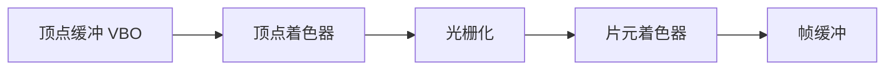
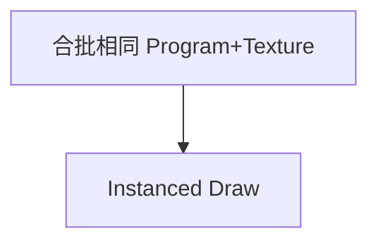

# WebGL 与 GPU 渲染概览

**WebGL** 在浏览器中暴露 OpenGL ES 子集：顶点着色器 + 片元着色器在 **GPU** 并行执行，适合大量三角形、粒子、后处理。**Three.js** 等库封装底层；面试与排障仍需知道缓冲、纹理、管线阶段与 draw call 成本。

---

## GPU 管线（简化）



| 阶段 | 输入/输出 |
|------|-----------|
| 顶点着色 | 顶点属性 → 裁剪空间 gl_Position |
| 光栅化 | 图元 → 片元候选 |
| 片元着色 | 插值 varyings → 颜色 gl_FragColor |
| 测试/混合 | 深度、模板、alpha blend |

WebGL2 / WebGPU：WebGPU 为下一代 API（更现代命令编码），概念可迁移。

---

## 核心对象

| 对象 | 作用 |
|------|------|
| **Buffer** | VBO/IBO 顶点/索引数据 |
| **Shader / Program** | GLSL 编译链接 |
| **Texture** | 采样图像 |
| **Uniform** | 全局常量 MVP 矩阵 |
| **Framebuffer** | 离屏渲染目标 |

```javascript
// 最小概念：清屏
gl.viewport(0, 0, canvas.width, canvas.height);
gl.clearColor(0.1, 0.1, 0.12, 1);
gl.clear(gl.COLOR_BUFFER_BIT | gl.DEPTH_BUFFER_BIT);
```

---

## 坐标变换链

Model → View → Projection → **NDC** → Viewport 像素。

```plaintext
gl_Position = P * V * M * vec4(position, 1.0);
```

见上文坐标变换链。透视除法后 x,y,z ∈ [−1,1]。

---

## 纹理与采样

| 概念 | 说明 |
|------|------|
| **UV** | 纹理坐标 0~1 |
| **Mipmap** | 多级渐远纹理，减摩尔纹 |
| **各向异性过滤** | 斜视角清晰度 |
| **sRGB 纹理** | 采样转线性（扩展） |

与 sRGB 纹理扩展相关 — 错误 gamma 导致 PBR 发灰，采样前应转到线性光再光照计算。

---

## 性能要点

| 瓶颈 | 对策 |
|------|------|
| draw call 过多 | 合批、图集、Instancing |
| 过度片元 | 减 overdraw、early-z |
| 着色器复杂 | 降精度 mediump |
| CPU 上传 | 复用 buffer、Orphaning |



**与浏览器合成**：WebGL canvas 作为一层参与 Layout → Paint → Composite；`preserveDrawingBuffer: true` 保留帧缓冲供截图，默认 false 可优化合成，但 `toDataURL` 可能抓黑帧。

---

## WebGL vs Canvas 2D

| 维度 | Canvas 2D | WebGL |
|------|-----------|-------|
| 学习曲线 | 低 | 高 |
| 大规模精灵 | 弱 | 强 |
| 2D 文本 | 内置 | 需纹理字体 |
| 调试 | 直观 | WebGL Inspector |

---

## 着色器最小片段（概念）

```glsl
// 顶点：传递裁剪空间位置
void main() {
  gl_Position = vec4(aPosition, 1.0);
}
// 片元：固定色
void main() {
  gl_FragColor = vec4(1.0, 0.2, 0.3, 1.0);
}
```

**精度**：`mediump` 在移动端足够多数 UI 特效；`highp` 大坐标 Z-fighting 仍可能发生 — 调整 near/far 平面。

---

## 深度测试与混合

WebGL 默认关闭深度测试；3D 场景需 `gl.enable(gl.DEPTH_TEST)` 并每帧 `clear(DEPTH_BUFFER_BIT)`。透明物体常需**从远到近**排序或使用 alpha blending 与 depth write 组合策略 — 否则半透明面片互相覆盖错误。

| 状态 | 典型设置 |
|------|----------|
| 不透明 mesh | depth test + depth write |
| 透明 mesh | depth test，可能关闭 depth write |
| UI 全屏 quad | 关闭 depth，纯 alpha blend |

---

## 上下文丢失与恢复

移动端切后台、GPU 驱动回收可能导致 **WebGL context lost** — 需监听 `webglcontextlost` / `webglcontextrestored`，在恢复后**重新上传** buffer、纹理、重新链接着色器。不做这步会白屏或黑屏。

```javascript
canvas.addEventListener('webglcontextlost', (e) => {
  e.preventDefault();
  // 暂停渲染循环
});
canvas.addEventListener('webglcontextrestored', () => {
  initGL(); // 重建全部 GPU 资源
});
```

---

## 小结

WebGL 用着色器在 GPU 绘制；**MVP 矩阵**与 **缓冲/纹理**是核心对象。性能看 draw call 与片元负载；颜色需线性空间意识。

**易混点**：WebGL 上下文 lost 需重建资源；深度测试默认关闭（WebGL 需显式开启）；纹理尺寸常为 2 的幂（非 POT 有限制）。

核对：顶点着色器与片元着色器各负责什么？为何 UI 大量小矩形用 DOM 有时比 WebGL 更合适？
