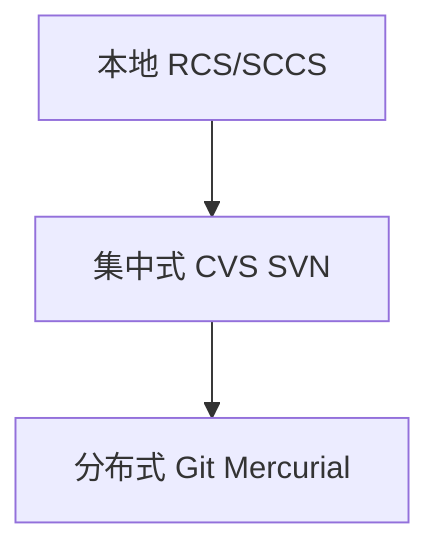
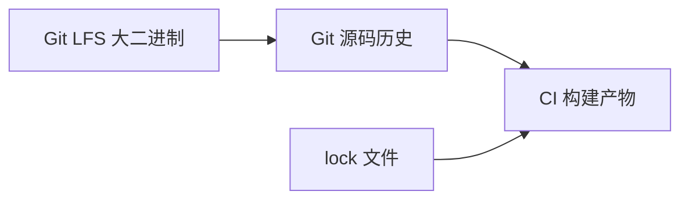

# 版本控制演化

**版本控制**解决协作中「谁在何时改了什么、如何回退与并行开发」。从**本地 RCS** 到**集中式 SVN/CVS**，再到**分布式 Git**，能力边界与信任模型逐步演进 — 理解演化路径，有助于区分「Git 特有概念」与「所有 VCS 共有需求」。Husky/CI 等工作流实践建立在 Git 的 push/merge 事件之上。

---

## 三代模型



| 代际 | 代表 | 特点 | 局限 |
|------|------|------|------|
| **本地** | RCS | 单文件历史 | 无协作 |
| **集中式** | SVN | 中央服务器权威 | 离线提交弱、分支重 |
| **分布式** | Git | 每人完整仓库副本 | 概念学习曲线 |

---

## 核心需求对照

| 需求 | SVN 思路 | Git 思路 |
|------|----------|----------|
| 快照/差异 | 增量 revision | 快照 + 对象 DAG |
| 分支 | 目录 copy/branches | 轻量指针 |
| 合并 | merge tracking | 三方 merge + commit |
| 离线 | 受限 | 本地 commit/rebase |

---

## 快照 vs 差异

**差异模型**：存相对上一版的 patch — 节省空间，取历史需重放。

**快照模型**（Git）：每次 commit 存**完整树快照**的引用（经对象 dedupe 压缩）— 快速 checkout，存储靠内容寻址去重。

```plaintext
SVN:  r100 → r101 → r102  （线性 revision 号）
Git:  commit DAG，多分支并行
```

Git 用 **blob / tree / commit** 对象构成快照；每次 commit 指向一棵完整目录树（内容寻址去重）。

---

## 为何前端团队普遍选 Git

| 因素 | 说明 |
|------|------|
| 分支/Feature 流 | 与 PR 文化匹配 |
| GitHub/GitLab | 生态默认 |
| 离线提交 | 本地 commit 后再 push |
| bisect / cherry-pick | 定位回归 |

Monorepo 与大仓库：`sparse-checkout`、partial clone — 不改变分布式模型。

---

## 各代解决什么问题

| 痛点 | 本地 RCS | SVN | Git |
|------|----------|-----|-----|
| 误删恢复 | 单文件回滚 | 中央库备份 | 任意 commit 可 checkout |
| 多人改同一文件 | 不支持 | 锁或合并 | 分支 + merge/rebase |
| 出差/断网 | — | 难提交 | 本地完整历史 |
| 代码审查 | — | 邮件 patch | PR + diff on DAG |

**前端场景**：设计稿与源码分离、lock 文件冲突、Monorepo 多包 — Git 的轻分支让「每个需求一条线」成本接近零；CI 在 push 时跑 lint/test 是团队约定。

---

## 与其他工具边界

| 工具 | 关系 |
|------|------|
| **npm lock** | 依赖锁定，非源码 VCS |
| **Git LFS** | 大二进制扩展 |
| **Submodules/subtree** | 嵌套仓库策略 |



**易混点**：`package-lock.json` 应进 Git，但 `node_modules` 不进；构建出的 `dist` 是否进库由团队策略定，与 VCS 原理无关。

---

## 从 SVN 迁到 Git 的常见困惑

| SVN 习惯 | Git 对应 |
|----------|----------|
| `svn update` | `git pull`（fetch + merge/rebase） |
| `svn commit` 直接上服务器 | `git commit` 本地 → `git push` |
| `branches/foo` 目录 | `refs/heads/foo` 指针 |
| revision 123 | commit hash（全局唯一） |

---

## Git 分布式体现在哪

每人 `git clone` 得到**完整对象库**（默认），本地可 `log`、`branch`、`commit` 无需连服务器；`push`/`fetch` 是与 `origin` 同步 ref — 中心远程是**协作约定**，不是架构必需。这与 SVN「工作副本 + 中央 revision」形成对比。

```plaintext
clone  ≈  完整 .git 对象库 + 工作区 checkout
fetch  ≈  只更新远程跟踪 ref，不动工作区
push   ≈  上传对象 + 更新远程分支 ref
```

**面试一句**：分布式指每个节点有完整历史能力，不是「没有 central remote」。

---

## lock 文件与可复现构建

`package-lock.json` / `pnpm-lock.yaml` 记录依赖精确版本，应纳入 VCS — 与源码快照同属「可复现构建」的一部分。依赖升级是独立 commit，便于 bisect 定位「哪次 lock 变更引入问题」。

---

## 版本号与 tag

语义化版本 `MAJOR.MINOR.PATCH` 是**发布约定**，不是 Git 内置 — 通过 **annotated tag** 指向 release commit 绑定。

---

## 面试对比：`clone` vs `checkout`

| | SVN checkout | Git clone |
|---|--------------|-----------|
| 本地得到 | 工作副本 + 中央 revision 指针 | 完整对象库 + 默认分支工作区 |
| 历史 | 通常浅或按需 | 默认全量（可 `--depth` 浅克隆） |
| 离线 log | 受限 | 完整 |

---

## 三代 VCS

| 代 | 代表 | 特点 |
|----|------|------|
| 本地 | RCS | 单文件历史 |
| 集中 | SVN | 服务器权威 |
| 分布 | Git | 全量克隆、DAG |

Git 优势在分支廉价与离线提交；SVN 路径复制模拟分支较重。

---

## 快照 vs 差异存储

| | Git | SVN |
|---|-----|-----|
| 存储单元 | blob 快照 + pack delta | 逐 revision delta |
| 相同文件 | 内容 hash 去重 | 路径 revision |
| 大文件 | LFS 指针 | 需外部方案 |

改一行代码 → 新 blob hash；未改文件仍指向旧 blob — 解释「为何 Git 分支切换快」。

---

## bisect 回归定位

`git bisect` 在 DAG 上做二分找引入 bug 的 commit：

```bash
git bisect start
git bisect bad                    # 当前版本有问题
git bisect good v1.0.0            # 已知好版本
# Git 检出中间 commit，测试后：
git bisect good   # 或 git bisect bad
git bisect reset                  # 结束
```

| 场景 | 价值 |
|------|------|
| 线上回归 | 从 tag 到 HEAD 二分 |
| lock 升级 | 定位哪次依赖变更 |

前端项目配合 `npm test` / E2E 脚本自动化 bisect — 每次 checkout 后重装依赖再测。

---

## 三棵树（工作区 / 暂存 / 仓库）

| 区域 | 命令影响 |
|------|----------|
| 工作区 | 编辑文件 |
| 暂存区 index | `git add` |
| 本地仓库 | `git commit` |

SVN 无本地完整 DAG，离线 commit 不可行 — Git 分布式核心差异之一。

---

## 集中式 vs 分布式（对照表）

| 维度 | SVN | Git |
|------|-----|-----|
| 权威副本 | 中央服务器 | 每个 clone 完整对象库 |
| 分支成本 | 目录复制 | 41 字节 ref 文件 |
| revision | 全局递增整数 | 内容 hash |
| 权限 | 路径级 ACL 常见 | 托管平台层实现 |

前端团队选 Git 的主因是 **PR + 轻分支 + 离线 commit**，而非「没有 central remote」，`origin` 仍是约定权威。

---

## 迁移自 SVN 的对应关系

| SVN | Git |
|-----|-----|
| checkout | clone |
| commit | commit + push |
| update | pull / fetch |
| branch 目录 | 分支指针 |
| revision | commit hash |

---

## 小结

版本控制从本地 patch → 中央 revision → 分布式快照 DAG。Git 的分布式与轻分支是前端协作标配；Hook/CI 建立在 Git 事件之上，与对象模型原理分层理解。

**易混点**：SVN revision 全局递增 vs Git commit hash 内容寻址；「检出」在 Git 是 HEAD 指向的快照，不是「下载 diff 列表」；分布式 ≠ 没有中心远程（`origin` 仍是约定权威）。

核对：`git clone` 与 SVN checkout 在本地得到的内容有何不同？为何 lock 文件应进 Git 而 `node_modules` 不进？
