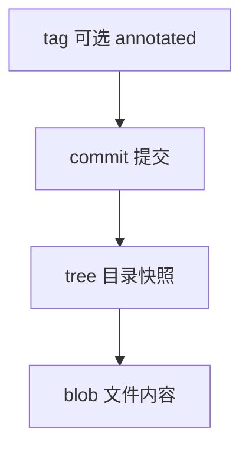
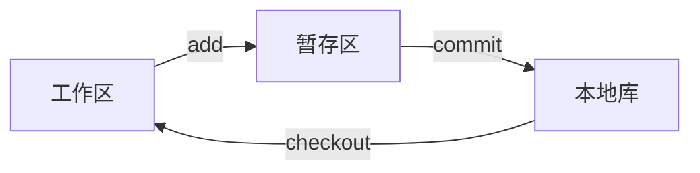
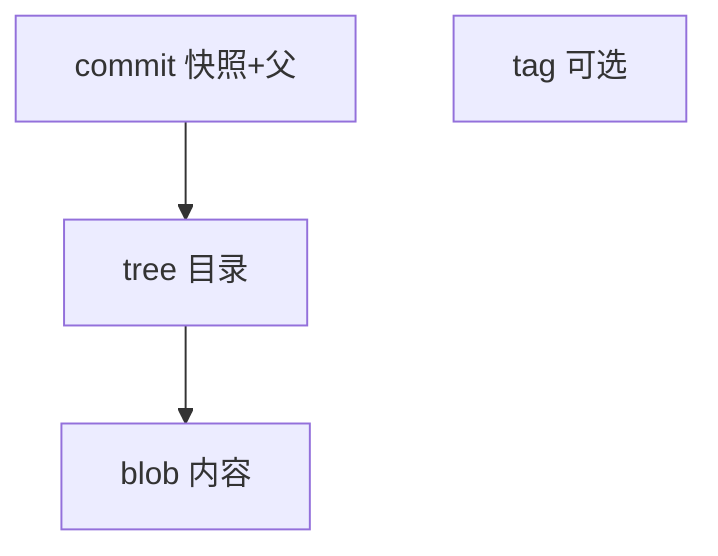

# Git 对象模型

Git 仓库本质是 **内容寻址的对象数据库** + **引用（分支/标签）**。`git add` / `commit` 不是「保存 diff 文件」，而是写入 **blob / tree / commit** 并用 SHA-1（或 SHA-256）索引 — 搞清对象图，`.git` 目录与 `reset`、`reflog` 行为就不再神秘。

---

## 四类对象



| 类型 | 存什么 | 类比 |
|------|--------|------|
| **blob** | 文件内容（无文件名） | 文件实体 |
| **tree** | 文件名 → blob/子 tree | 目录 listing |
| **commit** | tree + 父 commit + 作者/信息 | 快照节点 |
| **tag** | 指向 commit 的固定名 | 发布标记 |

```plaintext
commit → tree(root)
           ├─ blob (README)
           └─ tree (src/)
                 └─ blob (app.js)
```

---

## 内容寻址

```plaintext
SHA-1 = hash(类型 + 长度 + 内容)
```

相同内容 → **相同 hash** → 自动 dedupe。改一行 → 新 blob → 新 tree → 新 commit 链。

```bash
# 只读 plumbing 示例
git cat-file -p HEAD
git ls-tree HEAD
git rev-parse HEAD^{tree}
```

---

## 三区模型

| 区域 | 含义 |
|------|------|
| **工作区** | 磁盘文件 |
| **暂存区 index** | 下次 commit 的快照草稿 |
| **本地库** | 对象 + refs |



**易混点**：`commit` 只读 index，不自动包含工作区所有修改。`git add` 后改同一文件再 commit，commit 含 **add 时** 暂存的内容，不是 commit 瞬间磁盘版。

---

## 引用 refs

| ref | 指向 |
|-----|------|
| `HEAD` | 当前 commit（常经分支） |
| `refs/heads/main` | 分支 tip |
| `refs/remotes/origin/main` | 远程跟踪 |

分支是 **可移动指针**；创建分支 = 新建 ref，O(1)。

**符号引用**：`HEAD` 通常内容为 `ref: refs/heads/main`，解引用后才是 commit hash。

---

## 与 diff 的关系

`git diff` **运行时**比较 tree/blob；存储层仍是对象。`git show` = commit 元数据 + 相对父提交的 patch 视图。

分支与 merge 形成 commit DAG；`git diff` 运行时比较 tree/blob，存储层仍是对象。

---

## packfile 与 loose objects

日常 commit 生成 **loose object**；`git gc` 打包为 **packfile**，用 delta 压缩相似 blob — 对开发者透明，但解释「仓库体积」与 clone 速度。

| 命令 | 作用 |
|------|------|
| `git count-objects -vH` | 查看 loose/pack 大小 |
| `git verify-pack -v` | 调试 pack 内容 |

**浅克隆** `--depth=N` 只拉最近 N 层 commit，缺祖先对象 — CI 常用，本地开发需知 `git fetch ，unshallow` 补全。

---

## 对象在磁盘上的样子

```plaintext
.git/objects/
  ab/cdef1234...   # loose blob
  pack/pack-*.pack # 打包后 + .idx 索引
```

`git hash-object -w file` 可手动写入 blob；`git write-tree` 从暂存区写 tree — 理解 plumbing 命令有助于排障「对象损坏」「仓库膨胀」。

| 操作 | 新对象 |
|------|--------|
| 改文件内容 | 新 blob |
| 改文件名/路径 | 新 tree（父 tree 链更新） |
| commit | 新 commit 指向新 tree |

---

## index 与 tree 的关系

`git add` 把 blob hash 写入 **index**（`.git/index`），并记录路径、模式、时间戳。`git write-tree` 从 index 生成 tree — commit 快照与 index 一致，而非工作区全盘。

```bash
git ls-files -s   # 查看暂存区条目
```

---

## reset 与对象可达性

| 模式 | HEAD | index | 工作区 |
|------|------|-------|--------|
| `--soft` | 移动 | 不变 | 不变 |
| `--mixed`（默认） | 移动 | 重置 | 不变 |
| `--hard` | 移动 | 重置 | 重置 |

**悬空对象**：无 ref 指向的 commit 仍暂留，直到 `gc` — `reflog` 可找回误 reset 的 tip。

---

## 相同路径不同内容 vs 相同内容不同路径

相同文件内容 → **同一 blob**（无论路径）；改路径 → 新 tree 条目指向同一 blob hash — 解释「为何 rename 不一定增大仓库」。

---

## 四对象



`git cat-file -p HEAD` 可查看对象；SHA-1 内容寻址 — 改一字节 hash 全变。

---

## 例题：从 blob 到 commit 的路径

```bash
git hash-object -w README.md          # 写入 blob，输出 hash
git update-index --add --cacheinfo 100644,<hash>,README.md
git write-tree                        # 从 index 得 tree hash
git commit-tree <tree> -p HEAD -m "msg" # 新 commit
git update-ref refs/heads/main <new-commit>
```

日常用 `git add` + `git commit` 封装上述 plumbing；理解后可排查「index 与工作区不一致」「commit 了错误 staged 版本」。

---

## SHA-1 与 SHA-256 对象 id

Git 2.29+ 支持 **SHA-256** 对象格式（实验/迁移中）；默认仍为 SHA-1。无论算法，**内容寻址**语义不变：相同内容 → 相同 hash。

| 概念 | 说明 |
|------|------|
| 短 hash | 前 7～12 位通常可唯一标识 |
| 碰撞 | SHA-1 理论上可撞，Git 社区在迁移 |

`git rev-parse ，short HEAD` 输出短 id；CI 日志里常用短 hash 关联构建。

---

## 对象不可变性与 amend

commit 对象**不可变** — `git commit ，amend` 生成**新** commit hash，旧 commit 变悬空直到 gc。

| 操作 | 对象库 |
|------|--------|
| 改文件再 add | 新 blob |
| amend message | 新 commit，同 tree 可能 |
| rebase | 一串新 commit |

理解不可变性后明白：为何 force push 危险、为何 revert 比改历史安全。

---

## 对象查看命令

```bash
git cat-file -p HEAD
git ls-tree -r HEAD
git rev-parse HEAD
git count-objects -vH
```

---

## 小结

Git 用 blob/tree/commit 构成快照 DAG；**hash 寻址**去重；工作区、暂存区、本地库分离。分支是指向 commit 的指针。

**易混点**：文件名存在 tree 不在 blob；amend 改 commit 会换 hash；detached HEAD 是直接指向 commit 而非分支名；`git diff` 比较的是 tree，不是「diff 对象类型」。

核对：`git add` 后改同一文件再 commit，commit 含哪版内容？为何相同文件在不同路径可能共享 blob？`reset ，hard` 影响哪三区？

---

## 常见 plumbing 命令

| 命令 | 作用 |
|------|------|
| `git cat-file -t hash` | 对象类型 blob/tree/commit |
| `git ls-tree HEAD` | 当前 commit 的 tree 条目 |
| `git verify-pack -v` | 检查 pack 完整性 |
