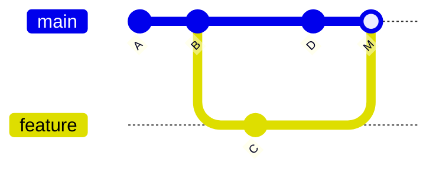
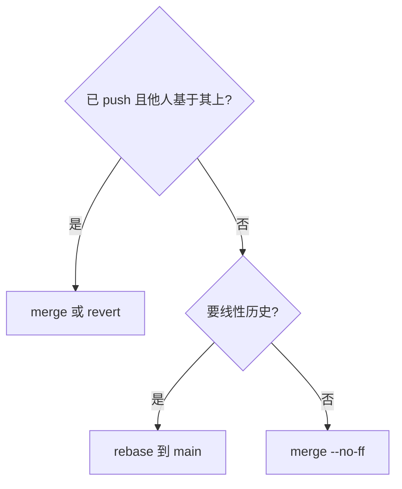

# 分支、合并与 DAG

Git 历史不是单线列表，而是 **有向无环图（DAG）**：commit 为节点，父指针为边。分支是移动指针；**merge** 产生汇合节点；**fast-forward** 只是指针前移 — 与图论中 DAG 拓扑概念同构。

---

## Commit DAG



| 术语 | 含义 |
|------|------|
| **父 commit** | 通常 1 个；merge 有 2+ |
| **根 commit** | 无父 |
| **可达性** | 从某 commit 沿父指针能走到的集合 |

---

## 分支本质

```plaintext
refs/heads/feature → commit C
refs/heads/main    → commit D
```

新建 commit 时：当前分支 ref **自动前移**到新 commit。

| 操作 | DAG 效果 |
|------|----------|
| `branch feat` | 新 ref 指向当前 commit |
| `checkout feat` | HEAD 指向 ref |
| 新 commit | ref 前移 |

---

## Fast-forward vs 三方合并

**Fast-forward**：main 未分叉，直接移动指针到 feature tip — 无 merge commit。

**三方 merge**：找 **merge-base**（最近公共祖先 LCA），合并两个分支相对 base 的改动 → **merge commit** 两父。

```plaintext
      C---D  feature
     /
A---B---E---M  main
         ↑ merge-base = B
```

| 冲突 | 同一文件同一区域两分支都改 → 需人工解决 |

```bash
git merge-base main feature   # LCA
git log --graph --oneline --all
```

**无冲突 merge**：两分支改不同文件或同文件不同区域 — Git 自动合并；仍可能产生 merge commit（非 FF 策略时）。

---

## 与 SVN 分支对比

| | Git | SVN |
|---|-----|-----|
| 创建成本 | 指针 | 目录 copy |
| 历史 | 保留完整 DAG | 常需 merge info |
| 并行线 | 原生 | 可行但重 |

---

## cherry-pick 与 revert

| 命令 | 效果 |
|------|------|
| **cherry-pick** | 复制某 commit 的 patch 为新 commit |
| **revert** | 新 commit 抵消指定 commit（不改写历史） |

二者都**追加** commit，适合已 push 的公共历史。

---

## octopus merge 与冲突标记

多分支（3+）合并产生 **octopus merge commit**（多父）；冲突文件含 `<<<<<<<` / `=======` / `>>>>>>>` 标记，需手工选块后 `git add`。

```plaintext
<<<<<<< HEAD
当前分支内容
=======
并入分支内容
>>>>>>> feature
```

**ours/theirs 语义**：merge 时 `HEAD` 为 ours；**rebase 时相反** — rebase 过程中「当前在 replay 的分支」视角变基，冲突解决易搞反，以 `git status` 提示为准。

---

## 远程跟踪与 push 本质

```plaintext
本地 refs/heads/main  →  commit D
远程 refs/remotes/origin/main  →  commit C（上次 fetch 所见）
git push  =  把本地 main 的 tip 告诉远程，并更新远程 refs/heads/main
```

`git fetch` 只更新远程跟踪分支，**不**改工作区；`git pull` = fetch + 合并到当前分支。多人协作时先 fetch 看分叉再决定 merge 或 rebase。

---

## detached HEAD

直接 checkout 到某 commit 时 HEAD 指向 hash 而非分支名；再 commit 会悬空，需 `branch` 保留或 `checkout` 回分支。`git switch -c fix` 从 detached 状态建分支可保留工作。

---

## 读 DAG 的常用命令

```bash
git log --graph --oneline --all --decorate
git show-branch main feature
git rev-list --count main..feature   # feature 领先几个 commit
```

**merge-base 用途**：不只 merge，**rebase**、**cherry-pick** 三方对比也依赖同一 LCA 算法 — 找最近公共祖先再 replay 或合并 patch。

---

## 拓扑序与提交顺序

DAG 上从根到 tip 的**拓扑序**不唯一 — `git log` 默认按 commit 时间排序，merge 图可能看起来「交叉」。理解「父指针方向」比记图形形状重要。

---

## merge 场景

| 情况 | 结果 |
|------|------|
| FF | 指针前移 |
| 三方 | 新 merge commit |
| conflict | 标记 <<<< |

`git merge-base A B` 求 LCA — rebase 也依赖同一祖先。

---

## 例题：cherry-pick 与 revert

| 命令 | 效果 | 是否改历史 |
|------|------|------------|
| `cherry-pick C` | 把 C 的 patch 应用到当前 HEAD | 新增 commit |
| `revert C` | 生成反 patch 抵消 C | 新增 commit |

```bash
git cherry-pick abc1234   # 挑单个 commit 到当前分支
git revert abc1234        # 安全撤销已推送 commit
```

二者都**不修改**原 commit C 的 hash — 与 rebase 改写不同；生产撤销已发布 commit 优先 `revert`。

---

## merge 还是 rebase？（决策）



公共 **main** 保护分支：incoming feature 用 merge PR；本地 feature 整理 commit 用 rebase -i。

---

## detached HEAD 实战

```bash
git checkout abc1234        # detached
git switch -c fix-from-tag  # 从 detached 建分支保留 commit
```

在 tag 上 hotfix 时常见：checkout tag → 改代码 → 新分支 → PR 回 main。

| 状态 | HEAD 指向 |
|------|-----------|
| 正常 | 分支名 → commit |
| detached | commit hash 直接 |

 detached 下新 commit 若不建分支，切走后 commit 悬空 — `reflog` 可找回。

---

## fast-forward 条件

当且仅当目标分支 tip 是源分支的**祖先**时，merge 可 FF — 仅移动指针，无 merge commit。

```bash
git merge feature   # 若 main 未动，FF 后 feature 与 main 同 tip
git log --oneline --graph --all
```

FF 后历史仍是一条线；`--no-ff` 强制留 merge 节点便于审计。

---

## 协作场景对照

| 场景 | 推荐 |
|------|------|
| feature 合 main | merge PR 或 squash merge |
| 本地整理 commit | rebase -i（未 push） |
| 撤销已发布 commit | revert |
| 挑 fix 到 release | cherry-pick |

---

## 小结

Git 历史是 commit DAG；分支为可移动指针。merge 依赖 **LCA 三方合并**；fast-forward 无分叉时仅移指针。

**易混点**：merge commit 有两个父；`git pull` = fetch + merge/rebase；冲突文件处于 unmerged 状态需 `add` 后 commit；FF 合并后 feature 指针仍可删除，历史无 merge 节点。

核对：何谓 fast-forward merge？两分支各改不同文件为何仍可能 conflict-free merge？cherry-pick 与 revert 为何都不改写旧 commit？
