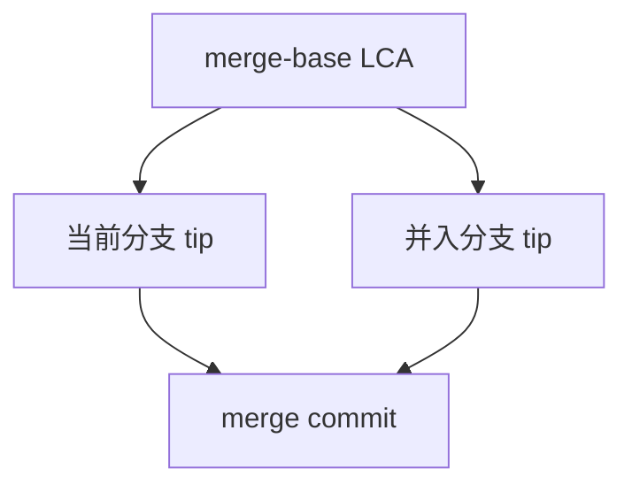
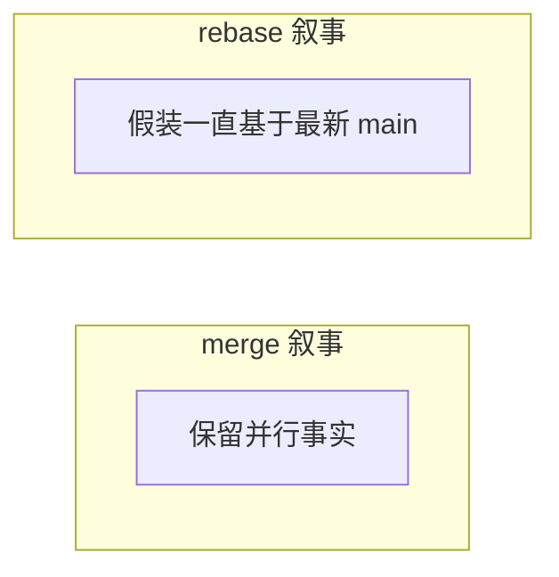

# rebase 与 merge（原理层）

**merge** 保留分叉拓扑，**rebase** 把提交序列「嫁接」到新基底上，改写本地 commit hash，使历史呈直线。二者不是对错，而是**历史叙事**与**协作约束**的权衡 — 公共分支上的 rebase 会改写他人基于旧 hash 的工作。

---

## merge 原理回顾



- 保留「何时并行开发」的真实拓扑  
- 适合 long-lived 分支、开源主分支  

---

## rebase 在做什么

```plaintext
原:  A---B---C  (feature)
         \
          D---E  (main)

rebase feature onto main:
      A---B---D---E---C'  (C' 内容与 C 相同，hash 不同)
```

步骤（简化）：

1. 找到 feature 相对 main 的 commit 列表（C）  
2. 暂存 patch  
3. 把 feature 指针移到 main tip（E）  
4. 依次 replay patch 为新 commit C'  

要点：**变基** — 改变「父链」，内容可相同但对象 id 全变。

---

## 对比表

| 维度 | merge | rebase |
|------|-------|--------|
| 历史形状 | 分叉+汇合 | 线性 |
| commit hash | 不变 | replay 后变 |
| 冲突解决 | merge 时一次 | 可能每 replay 一步 |
| 已 push 公共分支 | 安全（merge commit） | **危险**（需 force-with-lease） |



---

## interactive rebase

| 指令 | 作用 |
|------|------|
| pick | 保留 |
| squash/fixup | 合并到前一 commit |
| reword | 改 message |
| drop | 删除 |
| edit | 暂停以便 amend |

用于 PR 前整理 commit — 仅限**未共享**或团队允许 force 的分支。

---

## pull 的两种默认

```plaintext
git pull        # fetch + merge（可能产生 merge commit）
git pull --rebase  # fetch + rebase
```

**Golden rule**：**不要 rebase 已 push 且他人可能基于其开发的 commit** — 除非协调 force push。

---

## 与 merge-base 算法

Git 用 **commit-graph** 遍历找 LCA（最近公共祖先）；rebase 目标基底通常是 upstream tip。

---

## squash merge 与 rebase 的区别

| 操作 | 历史 | 适用 |
|------|------|------|
| **rebase** | 保留多个 commit，换父链 | 本地整理、未共享分支 |
| **merge ，squash** | 工作区合并结果，一次新 commit | PR 合并成一条 |
| **普通 merge** | 保留分叉 + merge commit | 公共主分支 |

`squash merge` **不**产生 merge commit，feature 上的 commit hash 也不会出现在 main — 丢的是中间粒度，换的是主分支线性可读。

---

## 冲突后流程

| 操作 | 中止 | 继续 |
|------|------|------|
| merge | `git merge ，abort` | `git add` + `git commit` |
| rebase | `git rebase ，abort` | `git add` + `git rebase ，continue` |

解决冲突后标记文件已解决 — rebase 每 replay 一个 commit 可能再次冲突。

---

## force-with-lease

比 `--force` 安全：仅当远程 ref 与本地预期一致时才覆盖 — 降低误盖他人 push 的风险。

```bash
git push --force-with-lease origin feature
```

---

## reflog 安全网

`git reflog` 记录 HEAD 移动，误 rebase 后常靠它找回「丢」掉的 commit — 本地安全网，不替代远程协作规范。

```bash
git reflog
git reset --hard HEAD@{2}
```

---

## rebase ≠ 无冲突

若 replay 的 patch 与基底 tip 改动同一区域，每步都可能冲突 — 冲突次数可能多于一次 merge。rebase 只是换父链，不 magically 消除语义冲突。

---

## 历史形状

| 操作 | 历史 |
|------|------|
| merge | 保留分叉 |
| rebase | 线性 replay |
| squash | 压成单 commit |

已推送共享分支避免 rebase 改写 — 改写 commit hash 他人需强制同步。

---

## interactive rebase 常用指令

```plaintext
pick   = 保留 commit
reword = 改 message
squash = 合并到上一 commit 并保留 message
fixup  = 合并到上一 commit 丢弃 message
drop   = 删除 commit
```

```bash
git rebase -i HEAD~5
```

仅用于**未推送**或团队协调后的本地整理；`fixup` 适合「WIP 小修」压进功能 commit。

---

## reset vs revert vs rebase

| 操作 | 改已有 commit | 适用 |
|------|---------------|------|
| `reset ，hard` | 移动分支指针，丢弃后续 | 本地未推送清理 |
| `revert` | 新增反向 commit | 已推送安全撤销 |
| `rebase` | 换父链，换 hash | 本地整理历史 |

已上 main 的 bug：**revert PR**，不要 `reset` 强推 main。

---

## ours / theirs 速查

| 场景 | ours | theirs |
|------|------|--------|
| merge 冲突 | 当前分支 HEAD | 并入分支 |
| rebase 冲突 | **upstream 基底** | **正在 replay 的 commit** |

rebase 时直觉易反 — 以 `git status` 与 `git diff ，ours/，theirs` 为准，不要凭感觉选块。

---

## squash merge 工作流

```bash
git checkout main
git merge --squash feature
git commit -m "feat: 完整功能描述"
```

feature 上多个 WIP commit 不会出现在 main — 丢粒度换主分支可读；与 `rebase -i squash` 类似但发生在 merge 侧。

## 小结

merge 保留 DAG 分叉；rebase replay patch 换父链、换 hash，历史更直。**公共历史用 merge/revert**；本地整理可用 rebase。Hook/CI 在 push 后触发 lint/test，属于团队自动化约定。

**易混点**：rebase ≠ 无冲突；`rebase ，continue` 与 merge 冲突流程类似；`merge ，squash` 不产生 merge commit 但保留工作区合并结果；rebase 时 ours/theirs 与 merge 相反。

核对：rebase 后原 commit C 的 hash 为何变？为何说「rebase 改写历史」？squash merge 与 rebase 的本质区别？

---

## 团队约定示例

| 分支 | 规则 |
|------|------|
| main | 仅 PR merge，禁止 force push |
| feature/* | 可 rebase -i 后 push ，force-with-lease |
| release/* | 仅 cherry-pick / hotfix |

---

## stacked PR（`--onto`）

```bash
git rebase --onto main topic~3 topic
```

把 `topic` 上最近 3 个 commit 挪到 `main` 新 tip 之上 — 依赖链 PR 常这样整理，避免 merge 大量无关历史。
