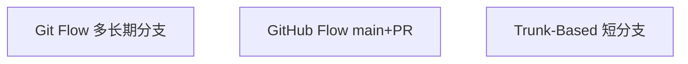

# 工作流概念

**Git 工作流**约定分支命名、集成时机与发布节奏 — 不是 Git 内置语法，而是团队协议。Git Flow、GitHub Flow、Trunk-Based 差异在「分支寿命」与「发布闸门」；前端 monorepo 常在 GitHub Flow 上叠加环境分支与 CI。Husky/pre-commit 在本地拦截，CI 在远程验证。

---

## 三种常见模型



| 模型 | 分支 | 发布 | 适用 |
|------|------|------|------|
| **Git Flow** | main/develop/release/hotfix | 版本火车 | 强版本移动客户端 |
| **GitHub Flow** | main + feature | main 即生产 | Web 持续部署 |
| **Trunk-Based** | main + 极短 feature/flag | 频繁集成 | 高 CI 成熟度 |

---

## GitHub Flow（前端常见）

```plaintext
main ───●───●───●───●  (始终可部署)
         \     /
          f1──f2  feature PR
```

1. 从 main 拉 feature  
2. 本地 commit + push  
3. **Pull Request** 评审  
4. CI 绿 → merge 到 main  
5. 自动部署 staging/prod  

**保护分支**：required review、status check — 原理是 ref 权限 + 远程 hook。

---

## Git Flow 要点

| 分支 | 角色 |
|------|------|
| `develop` | 集成线 |
| `release/*` | 冻结、修 bug |
| `hotfix/*` | 生产紧急补丁 |

合并回 main **打 tag** 发版。Web 团队因发布频度高，采用较少。

**与 GitHub Flow 本质区别**：Git Flow 有长期 **develop 集成线**，main 仅放发布；GitHub Flow **main 即集成+生产**，feature 短命。

---

## Trunk-Based 与 Feature Flag

短寿分支（<1 天）或直接 main + **功能开关** — 未完成代码不暴露用户。

| 实践 | 目的 |
|------|------|
| Small batch | 减 merge 冲突 |
| Feature flag | 解耦 deploy 与 release |
| Release train | 固定节奏上车 |

与 07-软件工程 中持续交付衔接。

---

## PR / Code Review 在流程中的位置

| 环节 | 验证 |
|------|------|
| PR diff | 人眼 + CODEOWNERS |
| CI | lint/test/build |
| Merge 策略 | squash / merge commit / rebase |

squash 合并把 feature 上多个 commit 压成 main 上一条；merge commit 保留分叉拓扑；rebase 合并要求 feature 已 rebase 到最新 main。

| 策略 | 主分支历史 | feature commit 保留 |
|------|------------|---------------------|
| Squash merge | 一条 | 否 |
| Merge commit | 分叉+汇合 | 是 |
| Rebase merge | 线性 | 是（换 hash） |

---

## 环境分支 vs 同一 main

| 模式 | 说明 |
|------|------|
| **单 main 多环境** | CI 按 tag/参数部署（推荐） |
| **env 分支** | staging/prod 分支易漂移 |

长期 env 分支与 main 分叉后，merge 成本指数上升 — 环境差异应用配置/参数，非长期分支。

---

## Release 与 tag

| 对象 | 作用 |
|------|------|
| **annotated tag** | 带作者/message，可 GPG 签 |
| **lightweight tag** | 仅指向 commit |
| **GitHub Release** | tag + 发行说明 + 附件 |

前端发版：`v1.2.3` tag 触发 CI 构建产物 — 原理是 **ref 不可变指针** + webhook 触发流水线。

```bash
git tag -a v1.0.0 -m "release"
git push origin v1.0.0
```

---

## Monorepo 与多包发布

| 策略 | 说明 |
|------|------|
| **单仓多包** | lerna/changesets 按包版本 |
| **trunk + changeset** | PR 带变更说明，CI 自动 bump |
| **tag 触发** | `v2.1.0` 只构建变更包 |

工作流仍是 GitHub Flow 变体：main 可部署，差异在**版本号与 changelog**如何与 commit 关联 — 原理层仍是 tag 指向 commit。

---

## hotfix 路径

生产 bug 从 `main` 拉 `hotfix/*` → 修完合并回 `main` 并 tag → 再 cherry-pick 或 merge 回长期集成分支（若用 Git Flow）。Web 团队常简化为：hotfix PR 直并 `main` + 立即部署。

---

## protected branch 与 Hook

禁止 force push、要求 review 与 CI — 在 GitHub/GitLab 设置层实现，不改变本地 Git 对象模型。pre-commit Hook 在 `commit` 前跑 lint，与远程 protected branch 互补。

---

## 前端团队选型建议

| 团队特征 | 倾向 |
|----------|------|
| Web SaaS、日部署 | GitHub Flow / Trunk-Based |
| 移动 App、版本火车 | Git Flow 变体 |
| Monorepo 多包 | GitHub Flow + changesets |

---

## 工作流

| 模型 | 特点 |
|------|------|
| Git Flow | release/hotfix 分支 |
| GitHub Flow | main + PR |
| Trunk | 主干小步 |

CI 在 PR 跑测试；protected branch 禁止直接 push main。

---

## PR 合并策略对比

| GitHub 选项 | 历史形状 | 适用 |
|-------------|----------|------|
| Merge commit | 保留分叉 + merge 节点 | 公共 main、审计要完整图 |
| Squash and merge | main 上一条 commit | 功能分支 commit 太碎 |
| Rebase and merge | 线性、无 merge 节点 | 要求直历史、commit 已整理 |

前端 Monorepo 常在 PR 用 squash，release 用 annotated tag 指向合并 commit。

---

## Git Hook 与 CI 分工

| 层级 | 时机 | 典型检查 |
|------|------|----------|
| pre-commit | `git commit` 前 | lint-staged、格式化 |
| pre-push | `git push` 前 | 单元测试 |
| CI | push/PR 后 | 全量 test、build |

Hook 在开发者机器执行，可 `--no-verify` 跳过；CI 是团队门禁 — 二者互补，Hook 不能替代 CI。

```json
// package.json — husky 绑定 pre-commit
{ "scripts": { "prepare": "husky" } }
```

---

## Release Train 与 Feature Flag

固定节奏发版（如双周）+ **feature flag** 隐藏未完成代码 — Trunk-Based 核心配套。

| 策略 | 说明 |
|------|------|
| Release train | 到点发版，未完成功能 flag 关 |
| 长期 env 分支 | staging/prod 分支易 drift，不推荐 |
| tag 触发 CI | `v*` tag → 构建产物 immutable |

Web 团队常见：**main 可部署** + flag 控制曝光，而非维护 `develop` 集成分支。

---

## CODEOWNERS 与审查

```plaintext
# CODEOWNERS
/src/api/     @backend-team
/packages/ui/ @design-system
```

PR 自动 @ 对应 reviewer；与 protected branch、required status checks 组成合并门禁 — 不改变 Git 对象模型。

## 小结

工作流是分支寿命与集成策略的约定：GitHub Flow 适合 Web PR；Git Flow 偏版本化产品；Trunk-Based 要求强 CI 与开关。Git 原理讲对象与 DAG；Hook/流水线是工程落地，不改变本地 merge/rebase 语义。

**易混点**：工作流 ≠ Git 命令集；squash merge 丢分支内 commit 粒度；protected branch 不能 force push；deploy 与 release 可用 feature flag 解耦。

核对：GitHub Flow 的「单一 main」与 Git Flow 的 develop 集成线有何本质区别？Feature flag 如何支持 Trunk-Based？

---

## 发版检查清单

| 项 | 说明 |
|----|------|
| tag 语义化 | vMAJOR.MINOR.PATCH |
| CI 绿 | main 上 required checks |
| 变更日志 | Release notes 或 CHANGELOG |

---

## Trunk-Based 要点

| 实践 | 目的 |
|------|------|
| 短生命分支（<2 天） | 减少 merge 冲突 |
| Feature flag | 未完成功能不阻塞发版 |
| 强 CI | 主干始终可部署 |
