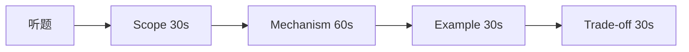

# 面试答题框架

原理面试不是背诵词条，而是**结构化表达**：先界定问题域，再分层机制，最后落到前端场景与权衡。统一框架可覆盖网络、OS、浏览器、算法与系统设计 — 串联 计算机基础篇 各模块。

---

## STAR-R 变体（技术题）

| 步骤 | 含义 | 示例（事件循环） |
|------|------|------------------|
| **S** Scope | 界定范围 | 「浏览器主线程」 |
| **M** Mechanism | 核心机制 | 宏/微任务队列 |
| **E** Example | 短例 | `Promise.then` vs `setTimeout` |
| **T** Trade-off | 权衡/边界 | Worker、阻塞影响 |
| **L** Link | 衔接知识点 | 如进程线程、事件循环 |



**时长建议**：单题 2～4 分钟；深挖由面试官引导。

---

## 分层答题模板

```plaintext
1. 一句话定义（是什么）
2. 为什么需要（问题背景）
3. 怎么工作（步骤/数据结构）
4. 前端里在哪遇到
5. 常见坑 / 与 X 的区别
```

**反模式**：一上来堆术语无主线；把 HTTP 缓存与 CDN 混为一谈；只说「八股答案」无场景。

---

## 对比题专用模板

两概念题（merge vs rebase、进程 vs 线程）用**三列表**：

| 维度 | A | B |
|------|---|---|
| 定义 | … | … |
| 场景 | … | … |
| 代价 | … | … |

先给**一句关系**（「A 保留分叉，B 改写父链」），再展开 — 避免只讲一边。

---

## 题型路由

| 信号 | 优先知识点 |
|------|------------|
| TCP/HTTPS/DNS | 计算机网络、TLS、HTTP |
| 进程线程锁 | 操作系统、调度、同步 |
| 数组链表树 | 数据结构、复杂度 |
| 复杂度 DP | 算法、递推与状态 |
| 渲染事件循环 | 浏览器、JS 引擎 |
| 短链/秒杀 | 系统设计、缓存与扩展 |

---

## 画图与口述

| 工具 | 适用 |
|------|------|
| 时序图 | TCP 握手、TLS |
| 框图 | 浏览器进程、Git DAG |
| 表格 | 对比题（merge vs rebase） |

白板题先**标名词**（Client、DB、Cache、Queue）再连线 — 六步：需求→估算→API→数据→框图→扩展。

---

## 追问时的收缩策略

面试官追问「再深一层」时，用 **两层下钻** 即止：

```plaintext
L0：用户可见现象（页面慢、Tab 崩溃）
L1：子系统机制（DNS、渲染流水线）
L2：数据结构/协议字段（选一项讲清）
```

再深（内核源码级）可坦诚边界，转回「接口层行为 + 排障命令」— 如 `curl -v`、`ss -tan`、`Performance` 面板。

---

## 不会时的策略

1. 诚实边界：「存储细节未读过，但接口层知道…」  
2. 类比已知：B-Tree 索引 ↔ 多级目录  
3. 反问澄清：QPS、一致性要求  

**忌**：长时间沉默或编造 — 结构化猜测优于胡编。

---

## 开场 30 秒示例

**题：从 URL 到页面展示？**

| 层 | 一句 |
|----|------|
| 网络 | DNS → TCP/TLS → HTTP 取文档 |
| 解析 | HTML/CSS → DOM/CSSOM → 渲染树 |
| 执行 | JS 下载解析，可能阻塞解析 |
| 绘制 | Layout → Paint → Composite 上屏 |

细节可展开 DNS 解析、TCP/TLS 握手、HTML 解析与合成上屏等机制；框架层只负责**顺序正确**。

**收尾句**：答完机制后补一句「我们项目里类似…」或「若 QPS 更高可…」— 体现 trade-off，比堆定义加分。

---

## 手写代码题衔接

| 阶段 | 动作 |
|------|------|
| 澄清 | 规模、边界、可否改输入 |
| 口述 | 模式 + 复杂度 |
| 编码 | 主干优先 |
| 自测 | 空、单元素 |

与算法题共用「先结构后细节」，先澄清规模与边界，再口述模式与复杂度，最后写代码。

---

## 项目经历嵌入点

| 原理题 | 项目锚点示例 |
|--------|--------------|
| 性能优化 | 虚拟列表减 Layout |
| 安全 | CSP、HttpOnly |
| 协作 | PR + CI 门禁 |

一句真实场景比十句抽象定义更有说服力 — 无项目可说「常见做法是…」。

---

## 时间失控时的裁剪

优先保留：**定义 + 机制 + 一个例子**；可砍：历史演进、冷门变种。对比题至少各讲 2 个维度。

---

## 追问应答清单

| 常见追问 | 应答方向 |
|----------|----------|
| 还能怎么优化 | 给 trade-off，不说「无限扩展」 |
| 和 XX 区别 | 双向对比 + 前端例 |
| 线上遇到过吗 | 现象 → 工具 → 根因 |
| 复杂度多少 | 说清 n 指什么 |

---

## Mock 面自评表

| 维度 | 1～5 自评 |
|------|-----------|
| 结构 | 是否有 Scope→Mechanism→Example |
| 深度 | 能否答到一层 follow-up |
| 场景 | 是否落到前端/项目 |
| 节奏 | 是否 2～4 分钟内收束 |

每周 mock 1～2 题并录音回听，比单纯刷阅读进度更有效。

---

## 开场 30 秒模板

```plaintext
这道题我按四层答：范围（浏览器主线程）→ 机制（宏/微任务）→ 例子（打印顺序）→ 权衡（长任务对 INP 的影响）。
```

---

## 追问应对（Follow-up）

| 面试官追问 | 策略 |
|------------|------|
| 「还有呢？」 | 同层再补一点，或诚实说边界 |
| 「为什么不用 X？」 | trade-off 表一行 |
| 「线上怎么验证？」 | Metrics / DevTools / curl |

深度控制在 **2 层**：机制 + 一层实现细节，第三层除非对方追问。

---

## 开场 15 秒模板（可直接背）

```plaintext
「这道题我从 [范围] 说起：[一句定义]。
机制上 [2～3 个关键点]。
在前端里 [一个例子]。
若 [约束变严]，会 [trade-off]。」
```

对比题第一句必须是关系句：「A 和 B 都用于…，区别在于…」

---

## 反模式清单

| 反模式 | 扣分原因 |
|--------|----------|
| 只背定义 | 无 Example / Trade-off |
| 单线堆术语 | 无 Scope 界定 |
| 对比只讲 A | 未双向 |
| 沉默超过 10s | 可结构化猜测 |

---

## STAR-R 速记

```plaintext
S — 范围  M — 机制  E — 例子  T — 权衡  L — 衔接相关知识点
```

---

## 模拟面试周计划

| 日 | 内容 |
|----|------|
| 一 | 网络 + OS 各 1 题口述 |
| 二 | 浏览器 + JS 各 1 题 |
| 三 | 数据结构算法 1 题手写 |
| 四 | 系统设计白板 1 题 |
| 五 | 错题本复习 + mock 录音 |

每题严格 2～4 分钟计时，超时就练裁剪。

---

## 小结

技术面试用 **Scope → Mechanism → Example → Trade-off** 组织答案；先定义再机制再前端映射。

**易混点**：定义 ≠ 实现细节；「底层原理」题也要说用户可见现象；对比题必须双向（A vs B，不能只讲 A）；收尾 trade-off 不可省。

核对：用框架回答「从 URL 到页面展示」应分几层、每层一句什么？对比题为何要先写「一句关系」？
