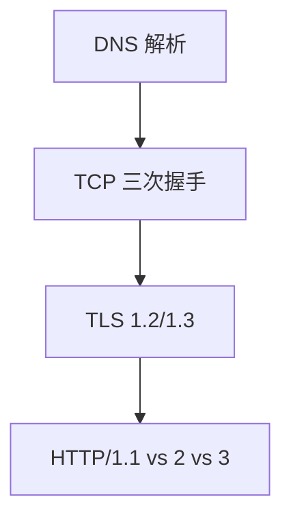
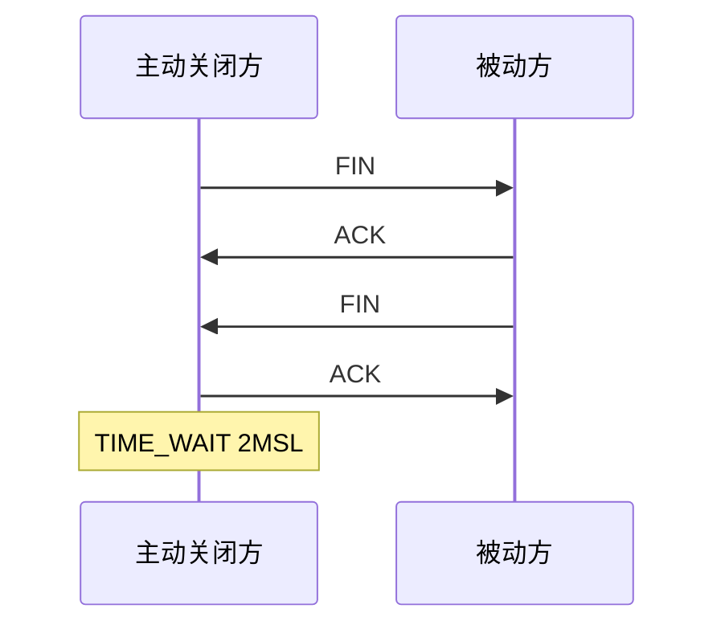

# 网络与 OS 高频题串讲

**网络栈**与**操作系统**是前端原理面试的双柱：DNS/TCP/HTTP 解释「请求为何慢、为何失败」；进程/线程/调度/内存解释「Node、Worker、卡顿从哪来」。本篇按题串组织要点，便于口述串联。

---

## 必会网络题链



| 题 | 要点 |
|----|------|
| 输入 URL | DNS→TCP→TLS→HTTP→解析渲染 |
| 三次握手 | SYN/SYN-ACK/ACK；防旧连接、同步序号 |
| TIME_WAIT | 主动关闭方等待 2MSL |
| HTTPS | 证书、密钥交换、AEAD |
| HTTP/2 | 多路复用、HPACK；队头阻塞在 TCP 层 |
| QUIC/HTTP3 | UDP+内置 TLS、连接迁移 |

**前端衔接**：缓存/CORS 属于浏览器策略；本篇偏协议与内核机制。

---

## 缓存与 Cookie（简表）

| 层 | 控制 |
|----|------|
| 强缓存 | Cache-Control / Expires |
| 协商 | ETag / Last-Modified |
| Cookie | Set-Cookie、SameSite、HttpOnly |

**易混点**：强缓存命中不发请求；`304` 是协商后复用本地副本；`no-cache` 仍需验证；Service Worker 缓存另层。

---

## OS 高频题链

| 题 | 要点 |
|----|------|
| 进程 vs 线程 | 地址空间、调度单位 |
| 死锁四条件 | 互斥、占有等待、不可抢占、循环等待 |
| 虚拟内存 | 分页、页表、TLB |
| IO 多路复用 | select/poll/epoll |

```plaintext
Node 单线程 + libuv 线程池 ≈ 事件驱动 + 阻塞 IO 卸载
```

与浏览器 **事件循环**、**Worker 线程**对照作答。

---

## 综合串联题

**「页面打开慢怎么查？」**

| 层 | 查什么 |
|----|--------|
| DNS | 解析时延、预连接 |
| TCP/TLS | RTT、证书链 |
| HTTP | 体积、缓存、HTTP2 |
| 应用 | 阻塞脚本、LCP 资源 |

**「Node 适合 CPU 密集吗？」** — 单线程 event loop 不适合；`worker_threads`/集群 + Amdahl 定律（并行加速上限由串行部分决定）。

---

## 粘包与半包（TCP 字节流）

TCP 是**字节流**，无消息边界 — 应用需自定 framing（长度前缀、分隔符、HTTP Content-Length）。

```plaintext
发送两次 write 可能一次 read 收齐（粘包）
一次 write 可能被拆成多次 read（半包）
```

Node `net.Socket`、浏览器 WebSocket 帧已处理边界；裸 TCP 自定义协议面试常考。

---

## 四次挥手与 CLOSE_WAIT



| 状态 | 谁、为何 |
|------|----------|
| **TIME_WAIT** | 主动关，防旧包干扰新连接 |
| **CLOSE_WAIT** | 被动关，本端未 `close` — 常见于服务端 bug 漏关连接 |

前端直连 WebSocket 长连接时，服务端泄漏 CLOSE_WAIT 会导致 fd 耗尽 — 与浏览器关系不大，但全栈面会问。

---

## 口述模板：三次握手

```plaintext
1. 客户端 SYN，带初始序号
2. 服务端 SYN-ACK，确认并回自己的序号
3. 客户端 ACK，连接建立
为何不能两次：无法双向确认序号，且可能确认到已失效的旧连接请求。
```

**UDP 与 TCP 选型一句**：实时音视频、游戏状态可容忍丢包用 UDP；文件、API 要可靠有序用 TCP — QUIC 在 UDP 上重建可靠与 TLS，即 HTTP/3 的传输基础。

---

## DNS 面试要点

| 概念 | 一句 |
|------|------|
| 递归 vs 迭代 | 客户端→本地 DNS 递归；根→TLD→权威迭代 |
| 缓存 | TTL 控制；浏览器/OS 也有缓存 |
| HTTPDNS | 绕过 Local DNS 防劫持（了解） |

**预连接**：`<link rel="preconnect">` 提前 DNS+TCP+TLS — 优化首包时延。

---

## epoll vs select

| | select | epoll |
|---|--------|-------|
|  fd 规模 | O(n) 扫描 | 事件驱动 O(1) 就绪 |
| 触发 | 水平触发 | 边缘/水平可配 |

Node 在 Linux 上 libuv 用 epoll — 解释「单线程为何能扛大量连接」：IO 就绪才回调，非 per-connection 一线程。

---

## 虚拟内存与 OOM

进程见虚拟地址空间，物理内存不足时 swap/OOM killer — 前端 Tab 崩溃「Aw, Snap!」可能与 renderer 进程内存上限有关。

---

## 串联模板

「从 URL 到页面」串联：DNS → TCP → TLS → HTTP → 解析 → 渲染；任一步可展开。

| 追问 | 准备点 |
|------|--------|
| 为什么三次握手 | 同步序列号 |
| 进程线程 | 资源 vs 调度 |
| epoll | 就绪通知 |
## 口述练习

计时 2 分钟讲清「输入 URL 回车」全链路，每层至少一个协议名或系统调用名。

---

## 两分钟串讲表

| 阶段 | 必提词 |
|------|--------|
| DNS | 缓存、A 记录 |
| TCP | 三次握手、窗口 |
| TLS | 证书、1-RTT |
| 渲染 | DOM、合成层 |
## 跨层串联

进程 listen 端口 → TCP backlog → accept 返回 fd → read 阻塞/非阻塞 — 一条链串 OS 与网络。

---

## 两分钟口述脚本（模板）

```plaintext
0:00  DNS — 浏览器缓存 → OS → 递归到 A 记录
0:20  TCP — SYN/SYN-ACK/ACK，三次防半开与序号同步
0:40  TLS — 证书校验 + 密钥协商，1-RTT(1.3)
1:00  HTTP — 请求行/头/body，持久连接与 ALPN 选 h2
1:20  解析 — HTML→DOM，CSS→CSSOM，合成渲染树
1:40  绘制 — Layout/Paint/Composite，JS 可能阻塞解析
```

练习时用计时器，每层**一个协议名 + 一个现象**即可，勿背 RFC 编号。

---

## 高频追问速答

| 题 | 30 秒要点 |
|----|-----------|
| 四次挥手为何需要 TIME_WAIT | 防旧包干扰新连接；2MSL 等全网段消失 |
| 滑动窗口 | 流量控制；拥塞窗口另管拥塞 |
| 进程崩溃 Tab 还在 | 多进程隔离；Browser 可杀 Renderer |
| 死锁四个条件 | 互斥、占有且等待、不可抢占、循环等待 |

---

## 小结

网络题按 DNS→TCP→TLS→HTTP 链答；OS 题扣进程线程、内存、IO 多路复用与 Node/浏览器对照。

**易混点**：TCP 可靠 ≠ HTTP 必走 TCP（QUIC）；fork 与 spawn；虚拟内存 ≠ 物理内存大小；TIME_WAIT 在主动关闭方，CLOSE_WAIT 查对端程序。

核对：三次握手能否减为两次？为何 TIME_WAIT 要 2MSL？epoll 相对 select 优势一句？

---

## 口述计时练习

用手机计时 120 秒，必须提到：DNS、TCP 三次、TLS 证书、HTTP 持久连接、DOM 解析、合成层 — 漏一层扣一分自评。

---

## 常见 follow-up 速答

| 原题 | 追问 | 一句答 |
|------|------|--------|
| 三次握手 | 两次为何不够 | 无法双向确认序号，旧 SYN 可能误连 |
| epoll | ET 与 LT | ET 只通知一次，需读尽；LT 水平触发 |
| 虚拟内存 | 缺页中断 | 访问未映射页 → 内核加载页或 SIGSEGV |
