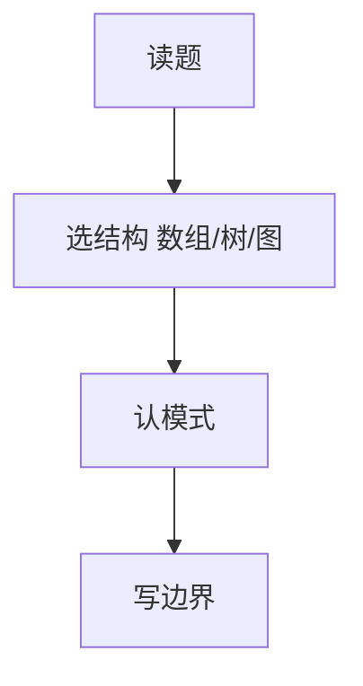
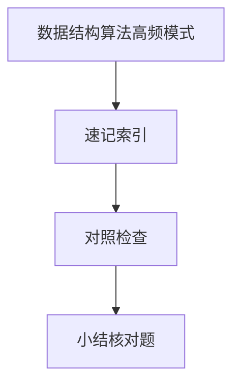

# 数据结构算法高频模式

LeetCode 与手写题表面千变万化，**模式**有限：双指针、滑动窗口、前缀和、二分、BFS/DFS、DP、堆 — 认信号词比背题号更高效。

---

## 模式速查表

| 模式 | 识别信号 | 复杂度直觉 |
|------|----------|------------|
| **双指针** | 有序数组、链表环 | O(n) |
| **滑动窗口** | 子串/子数组约束 | O(n) |
| **前缀和** | 区间和 query | 预处理 O(n) |
| **二分** | 单调性、第 k 小 | O(log n) |
| **BFS/DFS** | 树图、连通 | O(V+E) |
| **DP** | 最优子结构、重叠子问题 | 因题而异 |
| **堆** | TopK、流中位数 | O(n log k) |



---

## 前端映射（非仅刷题）

| 模式 | 工程例子 |
|------|----------|
| 双指针 | 合并有序接口分页 cursor |
| 滑动窗口 | 限流固定窗口/滑动窗口 |
| 拓扑排序 | 任务依赖、Webpack 模块 |
| Trie | 路由前缀、自动补全 |
| LRU | 缓存淘汰（Map+双向链表） |

Trie 按字符前缀建树，适合自动补全与 IP 路由匹配 — 空间换前缀查询 O(m)，m 为键长。

---

## 复杂度口算

| 操作 | 均摊 |
|------|------|
| 数组查 | O(1) |
| 数组插中间 | O(n) |
| 平衡 BST | O(log n) |
| 哈希 | O(1) 均摊 |

**主定理**（递归分治）：`T(n)=aT(n/b)+f(n)`，比较 `f(n)` 与 `n^log_b(a)` 决定主导项 — 如二分 `T(n)=T(n/2)+O(1)` → O(log n)。

---

## 经典题型对照

| 题型 | 模式 |
|------|------|
| 两数之和 | 哈希 |
| 最长无重复子串 | 滑动窗口 |
| 合并 K 链表 | 堆 |
| 岛屿数量 | DFS/BFS |
| 硬币兑换 | DP |

---

## 写代码面试 checklist

```javascript
// 边界：空、单元素、重复、溢出
function solve(input) {
  if (!input?.length) return defaultValue;
  // ...
}
```

1. 澄清输入规模与可否改原数组  
2. 说复杂度再写  
3. 跑小用例 + 边界  

---

## 复杂度追问模板

```plaintext
「时间 O(n)，因为每个元素最多进队出队各一次；
 空间 O(k)，窗口内哈希存最多 k 个键。」
```

**空间**别忘递归栈深度；**均摊**说明摊还操作（如动态数组扩容）。

| 结构 | 遍历 | 查找 |
|------|------|------|
| 数组 | O(n) | O(n) |
| 哈希 | O(n) | O(1) 均摊 |
| BST 平衡 | O(n) | O(log n) |

---

## 手写题时间分配（45min 场）

| 阶段 | 时间 | 动作 |
|------|------|------|
| 读题澄清 | 3 min | 规模、可否排序、可否额外空间 |
| 讲思路 | 5 min | 模式 + 复杂度 |
| 编码 | 25 min | 先主干后边界 |
| 自测 | 5 min | 空、单元素、重复 |

**信号**：面试官说「先写」— 减少叙述，边写边报复杂度；说「讲讲思路」— 别急着敲代码。

---

## 常见 follow-up

| 追问 | 方向 |
|------|------|
| 空间 O(1)？ | 双指针、原地交换 |
| 负数？ | 前缀和+哈希、排序后双指针 |
| 数据流？ | 堆、蓄水池 |

**LRU 口述**：Map 存 key→节点，双向链表维护访问顺序，get/put 时把节点移到表头，超容量删表尾 — O(1) 均摊。

---

## 图论模式

| 题 | 算法 |
|----|------|
| 岛屿数量 | DFS/BFS 计数连通分量 |
| 课程表 | 拓扑排序判环（Kahn / DFS 三色） |
| 最短路径（无权） | BFS |
| Dijkstra | 非负权边（了解） |

---

## DP 口述模板

先定义 `dp[i]` 含义，再写转移与边界 — 定义错则全错。

```plaintext
爬楼梯：dp[i] = dp[i-1] + dp[i-2]，边界 dp[0]=1, dp[1]=1
硬币兑换：dp[amt] = min(dp[amt-coin]+1)，边界 dp[0]=0
```

**0/1 背包**与**完全背包**转移式差一项 — 前者每件最多选一次，后者可重复选。

---

## 二分答案

「最小化最大值」「最大化最小值」类题 — 对答案空间二分 + 判定函数 `check(mid)`。判定单调即可二分，与标准数组二分不同在「猜答案」而非「找下标」。

```javascript
function binarySearchAnswer(lo, hi, check) {
  while (lo < hi) {
    const mid = (lo + hi) >> 1;
    if (check(mid)) hi = mid;
    else lo = mid + 1;
  }
  return lo;
}
```

---

## 回溯与剪枝

排列/组合/子集题 — DFS 枚举 + 约束剪枝（和超限、重复元素跳过）。与图 DFS 同栈思想，但状态是「已选集合」而非 visited 顶点。

---

## 模式识别

| 关键词 | 模式 |
|--------|------|
| 有序 | 二分/双指针 |
| 子数组 | 滑动窗口 |
| 方案数 | DP |
| 最短 | BFS |

先讲暴力复杂度，再优化 — 展示思路比背答案重要。
## 白板习惯

先写样例输入输出 → 暴力 → 优化 → 复杂度；边界 n=0、n=1、重复元素。
---

## 速记索引

| 小节 | 复习方式 |
|------|----------|
| 二分答案 | 复述定义 + 举一个前端相关例子 |
| 回溯与剪枝 | 复述定义 + 举一个前端相关例子 |
| 模式识别 | 复述定义 + 举一个前端相关例子 |
| 白板习惯 | 复述定义 + 举一个前端相关例子 |

## 对照检查

| 维度 | 自检 |
|------|------|
| 二分答案 易错 | 对照上文「易混点」或表格中的对比项 |
| 回溯与剪枝 易错 | 对照上文「易混点」或表格中的对比项 |
| 模式识别 易错 | 对照上文「易混点」或表格中的对比项 |
| 白板习惯 易错 | 对照上文「易混点」或表格中的对比项 |



本节目标：离开文档仍能解释 **数据结构算法高频模式** 的核心机制，并能在浏览器、Node 或工程排障中指认对应现象。
## 小结

认「信号词」选模式，在脑中补全数据结构与复杂度。前端场景（LRU 缓存、路由匹配、依赖调度）是同一模式落地，不是孤立 LeetCode 题。

**易混点**：DFS 栈溢出 vs BFS 队列空间；DP 状态定义错误全盘错；二分左闭右开 vs 闭区间；回溯与 DFS 枚举要会剪枝。

核对：「子数组和为 k」用前缀和+哈希的思路一句？K 路归并为何用堆？拓扑排序如何判环？
