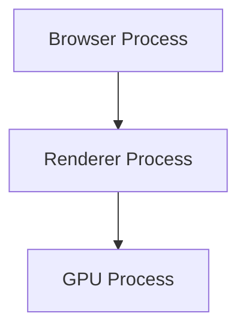
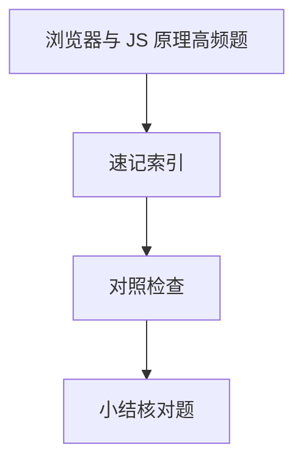

# 浏览器与 JS 原理高频题

**浏览器**是多进程系统；**JavaScript** 在 V8 中编译执行，受**事件循环**调度。渲染、安全、存储类面试题，应能串起进程架构、渲染流水线、V8 与 Web 安全模型。

---

## 架构一图



| 进程 | 职责 |
|------|------|
| Browser | UI、网络、存储协调 |
| Renderer | DOM/CSS/JS/布局绘制 |
| GPU | 合成加速 |

Renderer 内**单 JS 线程**写 DOM；跨进程通信走 IPC，Site Isolation 可把不同站点拆到不同 Renderer。

---

## 渲染路径（简）

```plaintext
HTML → DOM + CSSOM → Render Tree → Layout → Paint → Composite
```

| 题 | 要点 |
|----|------|
| 重排/重绘 | 几何 vs 外观；transform/opacity 常仅合成 |
| will-change | 提层换显存 |
| 首屏 | 关键路径、defer/async、preload |

**forced sync layout**：读 `offsetTop` 等几何属性会迫使浏览器先算 layout — 写后读交错会抖动性能。

---

## 事件循环

| 队列 | 例子 |
|------|------|
| 宏任务 | script、setTimeout、I/O |
| 微任务 | Promise.then、queueMicrotask |

```javascript
console.log(1);
setTimeout(() => console.log(2));
Promise.resolve().then(() => console.log(3));
console.log(4);
// 1 4 3 2
```

`await` 后续代码相当于微任务；`requestAnimationFrame` 在渲染前，通常晚于本轮微任务。

---

## V8 / 内存

| 题 | 要点 |
|----|------|
| 标记-清除 GC | 从根可达性；分代（新生代 Scavenge、老生代 Mark-Sweep） |
| 闭包 | 词法环境捕获，可达则不被回收 |
| 弱引用 | WeakMap/WeakRef 不阻止 GC |

**内存泄漏常见因**： detached DOM、未清定时器、闭包持有大对象、全局变量累积。

---

## 安全

| 攻击 | 机制 |
|------|------|
| XSS | 注入脚本，转义/CSP/HttpOnly |
| CSRF | 跨站伪造请求，SameSite/Token |
| 同源 | 协议+域+端口 |
| CSP | 内容白名单 |

**易混点**：HttpOnly 防 JS 读 Cookie 非防 XSS 提交；CORS 是浏览器 enforcement，服务端仍须鉴权。

---

## Storage

| API | 特点 |
|-----|------|
| Cookie | 随请求、4KB 级 |
| localStorage | 同步、同源 |
| IndexedDB | 异步、大容量 |

---

## 跨域与预检

**简单请求**直接发；带自定义头、`PUT`、`application/json` 等触发 **OPTIONS 预检** — 服务端需返回 CORS 头。

| 响应头 | 作用 |
|--------|------|
| `Access-Control-Allow-Origin` | 允许源 |
| `Access-Control-Allow-Credentials` | 带 Cookie 时不能 `*` |
| `Vary: Origin` | 缓存分 Origin |

**易混点**：CORS 仅浏览器强制；Postman/curl 不受限 — 不代表服务端可省略鉴权。

---

## 性能指标（常接在渲染题后）

| 指标 | 含义 |
|------|------|
| **FCP** | 首次绘制 |
| **LCP** | 最大内容绘制 |
| **CLS** | 布局偏移 |
| **INP** | 交互延迟 |

长任务切分、`scheduler.postTask` / `requestIdleCallback` 是 INP 优化手段 — 把非紧急工作移出输入关键路径。

---

## 脚本加载

| 属性 | 行为 |
|------|------|
| 默认 | 阻塞 HTML 解析 |
| `async` | 下载并行，执行仍可能阻塞 |
| `defer` | 下载并行，DOM 解析完后按序执行 |
| `type=module` | 默认 defer，严格模式 |

**易混点**：`async` 不保执行顺序，适合独立统计；关键依赖链用 `defer` 或放 body 末。

---

## 经典代码输出题

```javascript
async function async1() {
  console.log('async1 start');
  await async2();
  console.log('async1 end');
}
async function async2() { console.log('async2'); }
console.log('script start');
setTimeout(() => console.log('setTimeout'));
async1();
new Promise(r => { console.log('promise1'); r(); })
  .then(() => console.log('promise2'));
console.log('script end');
// script start → async1 start → async2 → promise1 → script end
// → async1 end → promise2 → setTimeout
```

**套路**：同步 → 微任务（含 `await` 后半）→ 宏任务。

---

## 从 URL 到首屏（浏览器段）

DNS/TCP/TLS/HTTP 完成文档下载后，浏览器内：HTML 解析建 DOM → 并行 CSS/CSSOM → 遇 script 可能阻塞解析 → Render Tree → Layout/Paint/Composite。关键路径上阻塞 script 会推迟首次绘制 — 用 defer/async/preload 优化。

---

## Service Worker 与多层缓存

| 层 | 说明 |
|----|------|
| Memory Cache | 当前 Tab 会话 |
| HTTP 缓存 | Cache-Control / ETag |
| SW Cache | `caches API`，可编程策略 |

排障看 Network `(from ServiceWorker)` / `(disk cache)` — 与 HTTP 强缓存不是同一层。

---

## 高频链

事件循环：宏微任务顺序；闭包：词法环境；原型：查找链；V8：隐藏类。

```javascript
Promise.resolve().then(() => console.log(1));
console.log(2); // 2 然后 1
```
## 手写常考

防抖节流、深拷贝（循环引用）、Promise 串行、LRU — 各准备一版可运行代码。
---

## 速记索引

| 小节 | 复习方式 |
|------|----------|
| 从 URL 到首屏（浏览器段） | 复述定义 + 举一个前端相关例子 |
| Service Worker 与多层缓存 | 复述定义 + 举一个前端相关例子 |
| 高频链 | 复述定义 + 举一个前端相关例子 |
| 手写常考 | 复述定义 + 举一个前端相关例子 |

## 对照检查

| 维度 | 自检 |
|------|------|
| 从 URL 到首屏（浏览器段） 易错 | 对照上文「易混点」或表格中的对比项 |
| Service Worker 与多层缓存 易错 | 对照上文「易混点」或表格中的对比项 |
| 高频链 易错 | 对照上文「易混点」或表格中的对比项 |
| 手写常考 易错 | 对照上文「易混点」或表格中的对比项 |



本节目标：离开文档仍能解释 **浏览器与 JS 原理高频题** 的核心机制，并能在浏览器、Node 或工程排障中指认对应现象。
## 小结

浏览器题 = 进程架构 + 渲染流水线 + 事件循环 + 安全模型。JS 题衔接 V8/GC/闭包。答机制时补一句用户可见现象与 DevTools 排障点。

**易混点**：微任务清空后才下一宏任务；composite 仍可能 layout 若后续读几何属性；`innerHTML` 可执行脚本而 `textContent` 仅文本。

核对：`requestAnimationFrame` 回调属于哪类任务？为何 `innerHTML` 与 `textContent` 安全含义不同？
