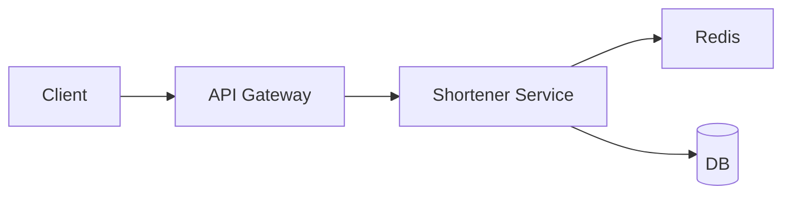

# 系统设计白板题套路

前端进阶面常遇**缩小版系统设计**：短链、Feed、实时通知、限流、文件上传 — 考查需求澄清、容量估算、组件划分与权衡，而非真实造轮子。

---

## 六步白板法


| 步 | 做什么 |
|----|--------|
| **需求** | 功能、非功能（QPS、延迟、一致性） |
| **估算** | DAU、读写比、存储/带宽量级 |
| **API** | REST/WS 主接口 |
| **数据** | 表/键、索引、缓存 |
| **设计** | 框图：客户端、网关、服务、存储 |
| **扩展** | 缓存、分片、队列、CDN |

---

## 容量估算模板

```plaintext
QPS ≈ DAU × 人均请求 / 86400
存储 ≈ 对象大小 × 条数 × 副本因子
带宽 ≈ QPS × 平均响应体
```

**例**：1000 万 DAU，每人 10 次读 → 峰值按 3× 粗算 ≈ 3500 QPS 量级（口算展示思路即可）。

---

## 常见组件

| 组件 | 用途 |
|------|------|
| **CDN** | 静态资源、边缘缓存 |
| **Redis** | 热数据、限流计数、Session |
| **MQ** | 削峰、异步 |
| **DB 主从** | 读扩展 |
| **分片** | 写扩展 |

数据库侧：热点查询加**索引**（B+ 树），写路径考虑**事务**边界与隔离级别 — 读多写少可先缓存再异步落库。

---

## 前端向系统设计题

| 题 | 要点 |
|----|------|
| **短链** | Base62、哈希冲突、302/301、缓存 |
| **Feed** | 推/拉模式、分页 cursor |
| **上传** | 分片、断点续传、直传 OSS |
| **限流** | 令牌桶/滑动窗口 |
| **WebSocket 推送** | 连接数、心跳、扩容 |

```plaintext
         ┌── API ──┐
Client ──┤         ├── Redis ── DB
         └── WS ───┘
```

---

## 短链服务展开（示例）

| 模块 | 设计点 |
|------|--------|
| **编码** | 自增 id → Base62，或 hash 截断 + 冲突重试 |
| **存储** | `short_code → long_url`，Redis 热码 + DB 持久 |
| **跳转** | 302 便于统计；301 可被浏览器缓存 |
| **热点** | 单码 QPS 极高 → 本地缓存 + CDN 边缘（慎用 301） |



---

## Feed 推拉模式

| 模式 | 做法 | 问题 |
|------|------|------|
| **拉（pull）** | 读时聚合关注列表 | 读放大，大 V 发推便宜 |
| **推（push）** | 写时 fan-out 到粉丝收件箱 | 百万粉丝写放大 |
| **混合** | 普通用户推，大 V 拉 | 工业界常见 |

分页用 **cursor**（`last_id`）优于 offset — 深页 offset 扫表慢，与前端无限滚动一致。

---

## 权衡话术

| 维度 | 选项 |
|------|------|
| 一致性 | 强一致 vs 最终一致 |
| 可用性 | CAP 直觉 |
| 延迟 | 边缘 vs 中心 |

**不要说**：「用微服务」而无拆分边界 — 先单体 + 清晰模块。

---

## 缓存三兄弟（口算必会）

| 问题 | 含义 | 对策 |
|------|------|------|
| **穿透** | 查不存在 key | 布隆过滤器、空值缓存 |
| **击穿** | 热 key 过期瞬间打穿 DB | 互斥重建、永不过期+异步刷 |
| **雪崩** | 大量 key 同时过期 | 随机 TTL、降级 |

**Cache-Aside**：读 miss 回源 DB 再写缓存；写 DB 后删缓存 — 前端静态资源用 CDN + 文件名 hash 是另一层缓存。

---

## 限流与降级

| 算法 | 特点 |
|------|------|
| 令牌桶 | 允许突发，匀速补充 |
| 漏桶 | 输出匀速 |
| 滑动窗口 | 精确统计窗口内次数 |

过载时**降级**：关非核心功能、返回默认数据、排队 — 与熔断（错误率超阈打开）配合。

---

## 四步设计

| 步 | 动作 |
|----|------|
| 需求 | QPS、延迟、一致性 |
| 估算 | 存储、带宽 |
| API | 读写路径 |
| 深潜 | 缓存、分片、单点 |

先写读写路径，再谈 CAP 取舍 — 秒杀题强调削峰与库存原子扣减。

---

## 白板例题：短链服务骨架

```plaintext
需求：读多写少，短码 → 长 URL，QPS 10k 读 / 100 写
API：
  POST /api/short  { url } → { code }
  GET  /{code}     → 302 长 URL

数据：
  code (62 进制 7 位) → url  主键
  缓存 Redis 热 key + DB 持久化

扩展：
  读 miss → 回源 DB + 写缓存
  热点 key → 本地 LRU + 单飞重建
```

画框图时标 **QPS、存储估算、单点**，面试官看取舍而非背组件名。

---

## 容量估算例题

```plaintext
短链：1 亿条，平均 url 200B → 存储 ≈ 20GB 原始
     读 QPS 10k，写 100/s
     缓存命中率 95% → DB 实际 500 QPS 读

带宽：10k × 302 响应 ~500B ≈ 5MB/s 出口
```

数量级**对即可** — 白板写 `10^4`、`10^7`，再乘单条字节；静态资源单独算 CDN。

---

## 白板时间分配（45 分钟题）

| 阶段 | 时间 |
|------|------|
| 澄清需求 | 5 min |
| 估算 QPS/存储 | 5 min |
| 画核心组件 | 15 min |
| 深潜 1～2 点 | 15 min |
| 总结权衡 | 5 min |

---

## 小结

系统设计 = 需求→估算→API→数据→框图→扩展。前端题常含 CDN、缓存、分页、WebSocket；答完框图补一句监控与失败模式（超时、重试、幂等）。

**易混点**：QPS 与并发连接数不同；缓存穿透/击穿/雪崩；301 可缓存、302 默认不可。

核对：设计短链服务如何存映射、如何处理热点 key？推模式 Feed 在百万粉丝场景的问题？

---

## 白板组件速查

| 组件 | 一句话 |
|------|--------|
| LB | 分发流量 |
| Cache | 减读库 |
| MQ | 异步削峰 |
| CDN | 静态边缘 |

---

## 白板检查清单

- [ ] 读写 QPS 与延迟目标
- [ ] 存储与带宽数量级
- [ ] 单点与冗余
- [ ] 缓存策略与失效
- [ ] 失败模式：超时、重试、幂等 id
