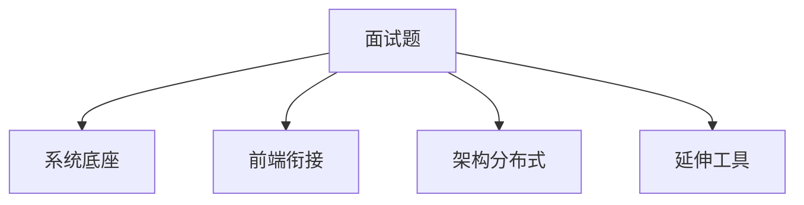
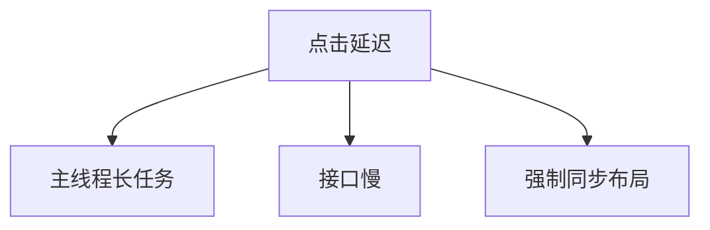
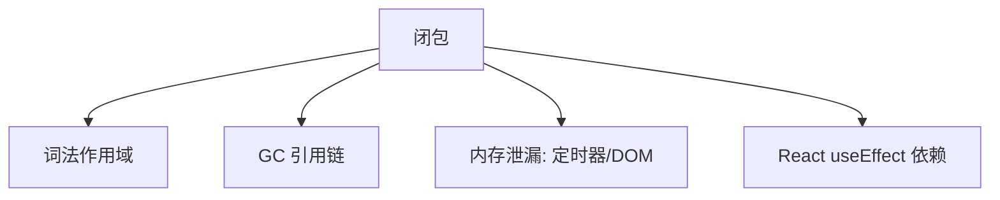

# 错题本与知识串联法

孤立刷题易导致「会背不会用」；**错题本**记录错因类型，**串联**把单点挂回知识网，才能稳定输出 — 配合面试答题框架使用。

---

## 错题本字段

| 字段 | 写什么 |
|------|--------|
| **题面** | 原题或关键词 |
| **错因分类** | 见下表 |
| **正确主线** | 3～5 句结构答案 |
| **知识域** | 网络 / OS / 浏览器 / 算法 / Git 等 |
| **复查日期** | 间隔重复 |

```markdown
## TCP TIME_WAIT
- 错因：概念混淆（与 CLOSE_WAIT）
- 主线：主动关闭方等 2MSL，防旧包干扰新连接
- 知识域：TCP 传输层
- 下次：2026-07-01
```

---

## 错因 taxonomy

| 类型 | 例子 | 对策 |
|------|------|------|
| **定义错** | 堆 vs 栈内存 | 重读定义段 |
| **边界漏** | 空数组、溢出 | checklist |
| **顺序错** | 事件循环输出 | 画队列 |
| **混淆对** | merge vs rebase | 对比表 |
| **只会背不会讲** | HTTPS 步骤 | STAR-R 口述 |

---

## 串联模板



**例：「页面卡顿」**

| 层 | 查什么 |
|----|--------|
| 长任务 | 主线程同步 JS、Performance 长条 |
| 布局 | forced sync layout、CLS |
| 网络 | 接口瀑布、缓存 |
| 包体积 | 首屏 JS、代码分割 |

---

## 复习节奏（建议）

| 阶段 | 动作 |
|------|------|
| 第 1 天 | 错题当天整理 |
| +3 天 | 口述不看笔记 |
| +7 天 | 关联一题扩展 |
| 考前 | 只过索引与易混点 |

按串讲清单勾选已覆盖题，避免重复刷已会模式。

---

## 原理 vs 实践对照

| 主题 | 原理 | 实践 |
|------|------|------|
| HTTP 缓存 | Cache-Control / ETag | 构建 hash、CDN 配置 |
| XSS | 同源、CSP | 框架转义、CSP 头 |
| Git | 对象 DAG、merge/rebase | PR 流程、CI |
| 测试 | 测试金字塔 | Vitest/Playwright |

**原则**：错题标注「该补哪块知识」，避免重复造轮子。

---

## 自测清单

- [ ] 每知识域至少 1 题能画 mermaid/表  
- [ ] 每域「小结·易混点」能口述  
- [ ] 串讲覆盖题无空白  
- [ ] 错题本 ≥30 条按 tag 分布  

---

## 串联示例：一道题挂多模块

**「用户说点击后 2 秒才有反应」**



| 排查 | 工具 |
|------|------|
| 长任务 | Performance |
| 接口 | Network 瀑布 |
| 布局抖动 | Performance Layout |

错题本记录时写清「本次错把 INP 只归因网络」类**错因**，而非只抄标准答案。

---

## 卡片化复习

把「易混点对」做成双面卡：正面两概念，背面一句关系 + 对比表一行。

| 正面 | 背面一句 |
|------|----------|
| TIME_WAIT vs CLOSE_WAIT | 主动关 vs 被动未 close |
| 强缓存 vs 协商 | 不发请求 vs 304 |
| micro vs macro task | 宏任务间清空 vs 每轮一个宏 |

---

## 周复习节奏（可执行）

| 周几 | 动作 |
|------|------|
| 一 | 新错题入库 + tag |
| 三 | 按 tag 口述 5 题 |
| 五 | 口述串讲网络/OS/浏览器/算法各 1 题 + 画一张图 |
| 日 | 只过各章「小结·核对」 |

每两周统计 tag 分布：哪类 `confuse` 最多，下周专项读对应模块 — 比随机翻书效率高。

---

## 精简字段与间隔复习

| 字段 | 作用 |
|------|------|
| 错因分类 | 概念/粗心/边界 |
| 正解一句话 | 可复述 |
| 关联题 | 同模式 |

间隔复习：1 天、3 天、7 天 — 比一次性刷题 retention 高。

---

## 错题本 Markdown 模板

```markdown
## [2026-06-22] TCP TIME_WAIT
- 题目：为何主动关闭方有 TIME_WAIT？
- 错因：confuse — 与 CLOSE_WAIT 搞反
- 正解：主动关、等 2MSL 防旧包进新连接
- tag: network, tcp
- 关联：四次挥手、端口复用 SO_REUSEADDR
- 下次复习：+3d
```

以**一道错题**为中心向外连 3～5 个概念 — 复习时走图口述，比线性重读效率高。

---

## 间隔复习节奏

| 阶段 | 间隔 |
|------|------|
| 第 1 次 | 当天 |
| 第 2 次 | +1 天 |
| 第 3 次 | +3 天 |
| 第 4 次 | +7 天 |

---

## 小结

错题本记录错因与正确主线并标注知识域；串联用分层地图把现象挂到机制。原理串讲与工程配置分开记 — 复习时两列对照。

**易混点**：错题本不是抄答案；串联不是全读一遍，是按弱项路径读；间隔重复优于考前突击。

核对：一道 TCP 题应链到至少哪两个非网络知识点？如何区分「定义错」与「混淆对」？

---

## 思维导图示例（闭包题）



以一道错题为中心连 3～5 个概念，闭卷走图口述。

---

## 费曼自测（1 分钟）

闭卷向假想的非技术同事解释刚错题的正确主线 — 卡壳处即下次复习入口；比复制粘贴标准答案更能暴露「假懂」。

---

## tag 分类建议

| tag | 含义 |
|-----|------|
| `define` | 定义说不清 |
| `confuse` | 与相近概念混淆 |
| `boundary` | 边界/特例漏了 |
| `apply` | 不会落到前端场景 |

每周统计 tag 频次，优先复习 `confuse` 最高的一类。
